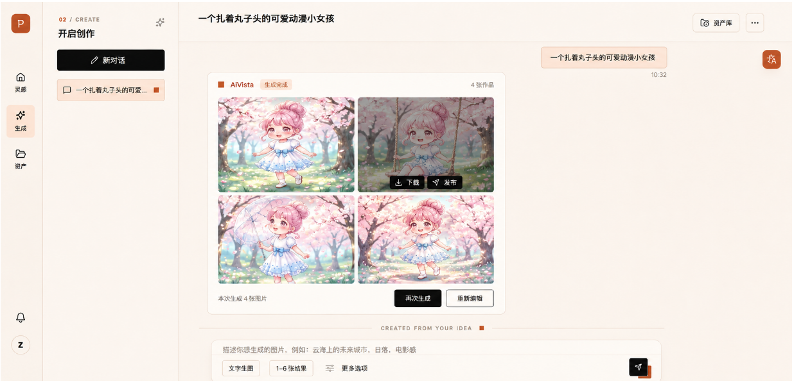
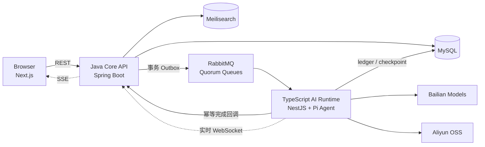

# AiVista

从灵感发现到 Agent 创作、资产管理与社区发布的全栈 AI 图像创作平台。

AiVista 是由 [superzheng777](https://github.com/superzheng777) 独立完成的个人项目，覆盖产品设计、Web 前端、Java Core 与 TypeScript AI Runtime。

> [!IMPORTANT]
> 核心创作闭环已经完成，项目仍在持续开发中。

[项目亮点](#项目亮点) · [产品展示](#产品展示) · [系统架构](#系统架构) · [本地运行](#本地运行) · [当前状态与路线图](#当前状态与路线图)


灵感探索页聚合社区公开作品，支持浏览、搜索与进入创作者主页，也是创作流程的主要入口。

## 项目亮点

- 串联灵感浏览、文生图、图生图、结果管理与社区发布，形成完整创作闭环。
- 提供 Agent 模式，由模型结合对话上下文、受限 Skill 与生成工具协作完成创作。
- 支持个人资产、收藏、关注、点赞、通知、创作者主页和关键词搜索。
- 使用事务 Outbox、RabbitMQ 与独立 AI Worker 承载耗时生成任务，并以幂等完成接口收敛状态。
- 原始图片保存在私有 OSS，通过缩略图、展示图、原图变体和短期签名 URL 按用途访问。

## 产品展示

### AI 创作

输入创作意图、画幅与生成数量，在同一工作台查看多张结果并继续管理资产。



### 资产管理

集中查看个人生成结果，并执行收藏、下载、发布或删除等操作。


### 个人主页

汇总创作者资料、关注关系与公开作品，连接创作和社区身份。


## 系统架构

一条生成请求由 Java Core 完成鉴权、额度检查和事务落库，再通过消息队列交给 AI Runtime。Worker 调用模型并转存图片后，只能通过受保护的内部接口提交结果；任务终态、额度和用户可见资产仍由 Java 在事务中统一确认。



Java Core 持有认证、业务状态、事务、配额和资产等权威数据；TypeScript AI Runtime 负责模型执行、工具调用和外部资源处理。实时事件用于改善交互及时性，浏览器断线重连后仍以 REST 快照恢复最终状态。

## 工程设计

| 问题 | 设计 | 结果 |
| --- | --- | --- |
| 业务事务与消息发布不一致 | 在同一数据库事务中写入任务和 Outbox，由 dispatcher 发布到 quorum queue 并处理发布确认 | 业务提交后命令可重试派发，避免依赖一次网络调用 |
| 消息重投可能重复产生外部副作用 | 采用至少一次传递、Worker ledger、checkpoint、稳定幂等键和 Java 幂等完成接口 | 重试复用既有执行结果，业务终态只收敛一次 |
| 实时连接可能中断或丢失瞬时事件 | Worker 经 WebSocket 推送到 Java，再由 SSE 投影到浏览器；REST 保存权威快照 | 实时体验与最终一致的页面恢复相互独立 |
| Agent 需要可控地使用业务能力 | 限定 Tool 白名单、授权输入资产、最大 Turn 数，并将取消信号贯穿执行链路 | 约束工具权限、资源范围和执行生命周期 |
| 私有图片需要适配不同展示场景 | OSS 保存私有对象，派生缩略图、展示图和原图，并签发短期访问 URL | 浏览器只获得当前用途所需的临时访问地址 |

## 技术栈

| 职责 | 技术 |
| --- | --- |
| Web | Next.js、React、TypeScript、Tailwind CSS、TanStack Query、Zustand |
| Core | Java、Spring Boot、Spring Security、MyBatis-Flex、Flyway |
| AI Runtime | NestJS、Pi Agent SDK、Bailian |
| Infrastructure | MySQL、RabbitMQ、Meilisearch、Aliyun OSS |

## 项目结构

```text
AiVista/
├── frontend/aivista/              # Next.js Web 应用与前端模块文档
├── backend/aivista/               # Java Core、数据库迁移与后端模块文档
├── backend-ts/                    # AI / 异步 I/O Worker
└── contracts/generation-worker/   # Java 与 Worker 的版本化生成协议
```

## 本地运行

需要准备 Node.js、pnpm、Java 25，以及可访问的 MySQL、RabbitMQ 和 Meilisearch。图片生成与存储还需要有效的阿里云百炼和 OSS 配置。

### 1. 启动 Java Core

复制本地配置模板，填写数据库、RabbitMQ、Meilisearch、百炼、OSS 和 JWT 配置，并将下方令牌占位符替换为仅在本机使用的随机值；真实凭证不要提交到 Git。首次启动时，Flyway 会为目标数据库执行版本化迁移。

```powershell
cd backend/aivista
Copy-Item .\src\main\resources\application-local.example.yaml .\src\main\resources\application-local.yaml
$env:AIVISTA_GENERATION_WORKER_TOKEN = '<local-shared-worker-token>'
.\mvnw.cmd spring-boot:run "-Dspring-boot.run.profiles=local"
```

Java Core 默认运行于 `http://localhost:8888/api`。

### 2. 启动 TypeScript AI Runtime

```powershell
cd backend-ts
pnpm install
$env:AIVISTA_JAVA_LOCAL_YAML = (Resolve-Path '..\backend\aivista\src\main\resources\application-local.yaml').Path
$env:AIVISTA_GENERATION_WORKER_TOKEN = '<local-shared-worker-token>'
pnpm build
pnpm worker
```

Worker 会复用 Java 本地配置，但不向浏览器提供 API。生成结果回调需要在 Java 与 Worker 进程中配置相同的 `AIVISTA_GENERATION_WORKER_TOKEN`；启用 Agent 模式时，还需配置 Agent 模型地址并在两个进程中设置 `AIVISTA_AGENT_ENABLED=true`。详见 [AI Runtime 文档](backend-ts/README.md)。

三个进程应分别使用独立终端。若只查看不依赖模型的页面，可以仅启动 Java Core 与 Web；完整图像生成链路必须同时运行 Worker，并确保外部服务和凭证均可用。

### 3. 启动 Web

```powershell
cd frontend/aivista
pnpm install
pnpm dev
```

浏览器访问 `http://localhost:3000`。开发环境默认将 `/api` 转发到 `http://localhost:8888`。

## 测试与质量

```powershell
# Java Core（backend/aivista）
.\mvnw.cmd test

# AI Runtime（backend-ts）
pnpm typecheck
pnpm test
pnpm build

# Web（frontend/aivista）
pnpm lint
pnpm test
pnpm build
```

## 当前状态与路线图

- **已完成：** 用户认证、图像生成、Agent 模式、个人资产与社区核心闭环。
- **持续完善：** 响应式与跨模块联调、图片 CDN 链路、互动数据查询优化。
- **生产前工作：** 部署方案、监控告警、备份恢复、安全审计与最终验收。

## 项目文档

- [前端项目开发文档](frontend/aivista/前端项目开发文档.md)：页面模块、工程边界与当前迭代状态。
- [Java Core 后端项目开发文档](backend/aivista/后端项目开发文档.md)：领域模块、基础设施与后端状态索引。
- [Agent 模式模块](backend/aivista/Agent模式模块.md)：会话、工具、事件投影、取消与一致性设计。
- [TypeScript AI Runtime](backend-ts/README.md)：Worker 配置、Pi Runtime、执行流程与质量门。
- [Generation Worker v1 协议](contracts/generation-worker/v1/README.md)：Java 与 Worker 之间的版本化消息和完成契约。

## 参与贡献

欢迎通过 Issue 报告问题，或通过 Pull Request 提交范围清晰的修复。涉及架构、协议或数据模型的调整，建议先在 Issue 中说明背景与方案。

## 许可证

本项目基于 [MIT License](LICENSE) 开源。
