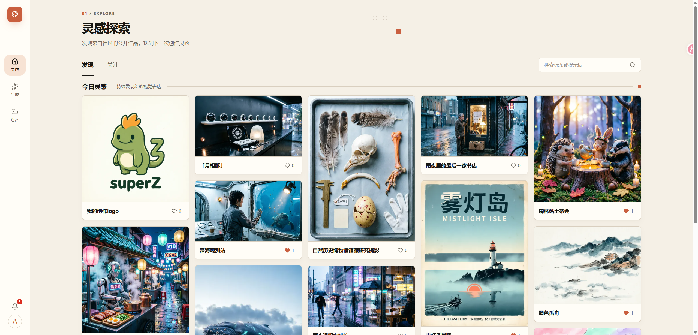
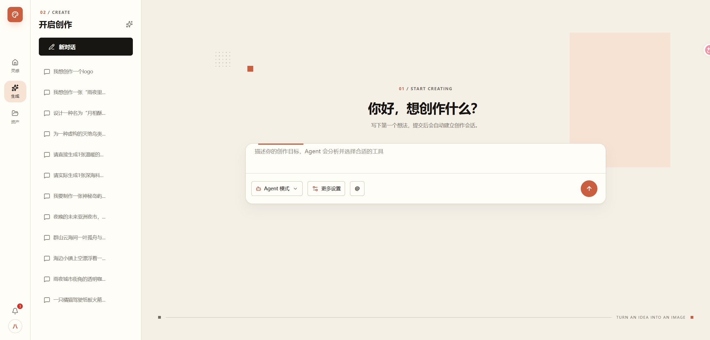
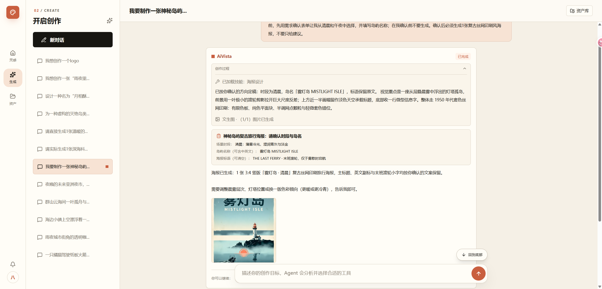
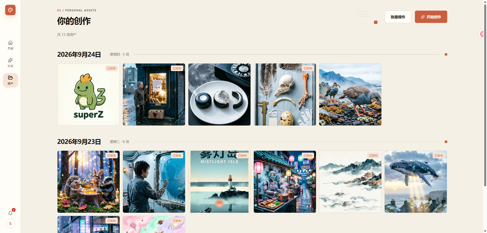
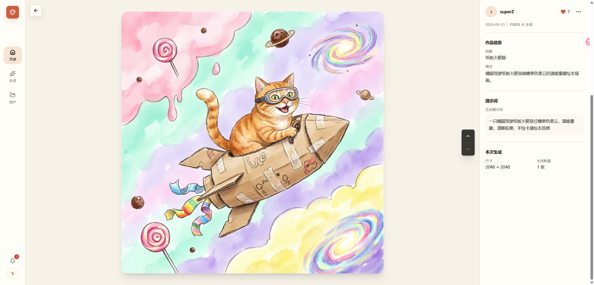
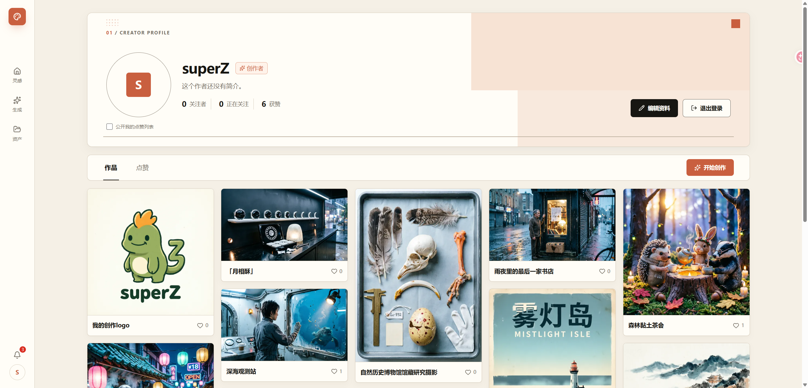
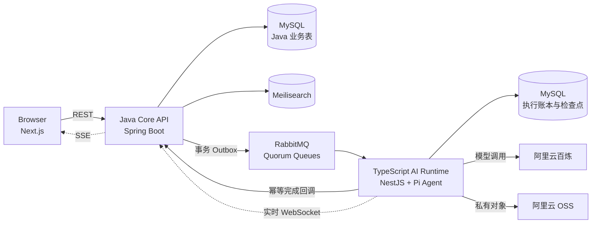

<h1 align="center">AiVista</h1>

<p align="center">从灵感发现到 Agent 创作、资产管理与社区发布的全栈 AI 图像创作平台。</p>

<p align="center">
  
  
  
  
  
  
  
</p>

AiVista 是由 [superzheng777](https://github.com/superzheng777) 独立设计并实现的个人项目，覆盖产品交互、Web 前端、Java Core、TypeScript AI Runtime 以及服务间协议。

[为什么做 AiVista](#为什么做-aivista) · [核心能力](#核心能力) · [产品展示](#产品展示) · [Agent 与内置 Skill](#agent-与内置-skill) · [系统架构](#系统架构) · [本地运行](#本地运行) · [项目文档](#项目文档)



灵感探索页聚合社区公开作品，支持浏览、搜索和进入创作者主页，也是创作流程的主要入口。

## 为什么做 AiVista

灵感出现时，往往还不是一句完整的提示词。它可能是一张参考图、一种氛围，或者一个说不清的画面。真正把它做成作品，还要逐渐明确主题和约束、选择视觉方向、查看并筛选生成结果，再把满意的图片整理起来，继续创作或公开分享。

AiVista 面向希望用 AI 把视觉想法做成作品的个人创作者。我想把这段常被拆开的过程接起来：从社区作品中寻找灵感，用直接生成或 Agent 协作完成创作，再把结果收进个人资产，并发布到社区。方向明确时，用户可以自己控制提示词、参考图、画幅和数量；想法还模糊时，Agent 会借助对应 Skill 追问关键问题，把没有说完整的意图整理成可执行的视觉方案。

我希望 AiVista 能接住一个念头从出现、成形到成为作品的过程。Agent 可以理解需求和执行工具，作品往哪里走、最终留下哪一张，仍由创作者决定。

## 核心能力

- 从公开灵感、关键词搜索和创作者主页进入文生图或图生图，再将结果沉淀为个人资产并发布到社区。
- 同时提供直接生成与 Agent 模式。Agent 可以结合对话上下文和八个内置 Skill 工作；信息不足时生成可恢复的确认表单，用户提交或跳过后继续，也可以取消整次创作。
- 支持个人资产、收藏、关注、点赞、通知和创作者主页等社区能力。
- 通过事务 Outbox、RabbitMQ 和独立 Worker 执行耗时任务，并按至少一次传递设计幂等收敛。
- 原始图片存放在私有 OSS，按使用场景生成缩略图、展示图和原图访问地址。

## 产品展示

首屏展示灵感探索页，下面依次展示 AI 创作、资产管理和个人主页三个主要工作区。

### AI 创作

从新建页选择直接生成或 Agent 模式，输入创作目标，并在左侧继续查看历史会话。



在 Agent 会话中查看 Skill 加载、结构化确认、创作过程和生成结果，并继续调整作品或进入资产库。



### 资产管理

集中查看个人生成结果，并按状态筛选或执行下载、发布和删除等操作。




### 资产详情




### 个人主页

汇总创作者资料、关注关系和公开作品，将创作记录与社区身份连接起来。



## Agent 与内置 Skill

AiVista Agent 按任务需要加载对应 Skill。Skill 定义需求收集、创作方法和检查项；实际图片读取、生成和表单交互仍受工具 Schema 与运行时校验约束。

| Skill | 适用任务 |
| --- | --- |
| [`poster-design`](backend-ts/.pi/skills/poster-design/SKILL.md)（海报设计） | 设计活动主视觉、宣传主图等单画布海报，保护既定文案并建立信息层级。 |
| [`brand-design`](backend-ts/.pi/skills/brand-design/SKILL.md)（品牌设计） | 从品牌、业务和受众信息中提炼定位，形成 Logo 概念与配套视觉方向。 |
| [`cinematic-still`](backend-ts/.pi/skills/cinematic-still/SKILL.md)（电影感摄影） | 把故事、人物、空间或产品转化为叙事剧照，并约束机位、光线和色彩连续性。 |
| [`impasto-diorama`](backend-ts/.pi/skills/impasto-diorama/SKILL.md)（油彩立体厚涂） | 将已授权照片重构为摄影与厚涂结合的立体微景观。 |
| [`monumental-scale-poster`](backend-ts/.pi/skills/monumental-scale-poster/SKILL.md)（巨物尺度清透海报） | 用巨物尺度、清透留白、反射介质和稀薄文字层构建单画布海报。 |
| [`portrait-face-director`](backend-ts/.pi/skills/portrait-face-director/SKILL.md)（人像捏脸） | 把脸谱方向和人物气质拆成可见的五官结构，用于人像 Prompt 或图像生成。 |
| [`japanese-life-fragments`](backend-ts/.pi/skills/japanese-life-fragments/SKILL.md)（日系生活碎片） | 将每张已授权照片分别转译为摄影与亚克力场景图结合的竖版海报。 |
| [`series-image-director`](backend-ts/.pi/skills/series-image-director/SKILL.md)（系列套图导演） | 建立系列视觉约束和变化矩阵，生成风格统一但内容不重复的套图。 |

完整触发条件和工作流见各 Skill 的 `SKILL.md`；运行机制与权限边界见 [Agent 模式设计](backend/aivista/Agent模式模块.md) 和 [TypeScript AI Runtime 文档](backend-ts/README.md)。

## 系统架构

生成请求先由 Java Core 完成鉴权、额度检查和事务落库，再通过消息队列交给 AI Runtime。Worker 调用模型并转存图片后，只能通过受保护的内部接口提交结果；任务终态、额度和用户可见资产仍由 Java 在事务中统一确认。



图中的两个 MySQL 节点表示同一数据库服务中的逻辑数据边界，并不要求拆成两个实例。Java Core 持有业务事实，AI Runtime 只维护执行所需的账本和检查点。实时事件用于改善交互及时性，浏览器断线或事件缺失时仍以 REST 快照恢复最终状态。

## 关键工程取舍

- **可靠投递：** Java Core 在同一事务中写入业务数据和 Outbox，再由 dispatcher 发布到 RabbitMQ quorum queue 并等待发布确认，网络失败时可以安全重试派发。
- **幂等收敛：** 系统按至少一次传递设计。任务 revision、确定性对象键、执行账本和条件完成接口共同吸收重复消息，不宣称 exactly-once。
- **实时与最终状态分离：** Worker 经 WebSocket 把过程事件交给 Java，再由 SSE 投影给浏览器；REST 快照始终是用户可见状态的最终依据。
- **受控的 Agent 执行：** 工具白名单、授权输入资产、最大轮数和取消信号共同限制执行范围。需要补充意图时，Worker 结束当前执行段，Java 原子保存表单和恢复上下文；用户提交、跳过或取消后再进入原有消息链路，无需让 Worker 线程持续等待。
- **可选运行追踪：** Langfuse 与 OpenTelemetry 默认关闭。观测失败不会改变业务状态，记录内容会省略图片二进制、模型思考内容和签名信息。
- **私有图片访问：** OSS 保存私有源文件和派生变体，浏览器只获得与当前用途匹配的短期签名 URL。

更细的状态机、恢复语义和消息契约放在[项目文档](#项目文档)中，README 只保留跨模块的关键决定。

## 技术栈

| 职责 | 技术 |
| --- | --- |
| Web | Next.js、React、TypeScript、Tailwind CSS、TanStack Query、Zustand |
| Java Core | Java、Spring Boot、Spring Security、MyBatis-Flex、Flyway |
| AI Runtime | NestJS、TypeScript、Pi Agent SDK、阿里云百炼、Langfuse / OpenTelemetry（可选） |
| 基础设施 | MySQL、RabbitMQ、Meilisearch、阿里云 OSS |

## 项目结构

```text
AiVista/
├── frontend/aivista/              # Next.js Web 应用与前端模块文档
├── backend/aivista/               # Java Core、数据库迁移与后端模块文档
├── backend-ts/                    # AI Runtime、异步 Worker 与 .pi/skills
└── contracts/generation-worker/   # Java 与 Worker 的版本化生成协议
```

## 本地运行

以下命令以 Windows PowerShell 为例。开始前需要准备 Node.js 22.19+、pnpm 10、Java 25，以及可访问的 MySQL、RabbitMQ 和 Meilisearch。完整图像生成还需要有效的阿里云百炼和 OSS 配置。

```powershell
git clone https://github.com/superzheng777/AiVista.git
cd AiVista
```

### 1. 启动 Java Core

复制[本地配置模板](backend/aivista/src/main/resources/application-local.example.yaml)，填写数据库、RabbitMQ、Meilisearch、百炼、OSS 和 JWT 配置。将下方令牌占位符替换为仅在本机使用的随机值，不要向 Git 提交真实凭证。首次启动时，Flyway 会为目标数据库执行版本化迁移。

```powershell
cd backend/aivista
Copy-Item .\src\main\resources\application-local.example.yaml .\src\main\resources\application-local.yaml
$env:AIVISTA_GENERATION_WORKER_TOKEN = '<local-shared-worker-token>'
$env:APP_AGENT_ENABLED = 'true'
.\mvnw.cmd spring-boot:run "-Dspring-boot.run.profiles=local"
```

Java Core 默认运行于 `http://localhost:8888/api`。

### 2. 启动 TypeScript AI Runtime

在新的终端中执行：

```powershell
cd backend-ts
pnpm install
$env:AIVISTA_JAVA_LOCAL_YAML = (Resolve-Path '..\backend\aivista\src\main\resources\application-local.yaml').Path
$env:AIVISTA_GENERATION_WORKER_TOKEN = '<local-shared-worker-token>'
$env:AIVISTA_AGENT_ENABLED = 'true'
pnpm build
pnpm worker
```

Worker 复用 Java 本地配置，但不向浏览器提供 API。Java 与 Worker 必须使用相同的 `AIVISTA_GENERATION_WORKER_TOKEN`。启用 Agent 模式时，Java 终端设置 `APP_AGENT_ENABLED=true`，TS Worker 终端设置 `AIVISTA_AGENT_ENABLED=true`，同时由 Worker 通过 `AIVISTA_JAVA_LOCAL_YAML` 读取同一份 Java 本地配置。可选环境变量见 [`.env.example`](backend-ts/.env.example)，完整说明见 [AI Runtime 文档](backend-ts/README.md)。

### 3. 启动 Web

在第三个终端中执行：

```powershell
cd frontend/aivista
pnpm install
pnpm dev
```

浏览器访问 `http://localhost:3000`。开发环境默认将 `/api` 转发到 `http://localhost:8888`。若只查看不依赖模型的页面，可以仅启动 Java Core 与 Web；完整生成链路必须同时运行 AI Runtime，并确保外部服务和凭证可用。

## 测试与质量

下面每个代码块都从仓库根目录执行。Java 测试覆盖领域服务与数据访问，AI Runtime 测试覆盖消息契约、幂等行为和 Agent 执行，Web 测试覆盖状态模型、事件解析与关键组件。

Java Core：

```powershell
cd backend/aivista
.\mvnw.cmd test
```

AI Runtime：

```powershell
cd backend-ts
pnpm install
pnpm typecheck
pnpm test
pnpm build
```

Web：

```powershell
cd frontend/aivista
pnpm install
pnpm lint
pnpm test
pnpm build
```

## 项目文档

- [前端项目开发文档](frontend/aivista/前端项目开发文档.md)：页面模块、交互流程和工程边界。
- [Java Core 后端项目开发文档](backend/aivista/后端项目开发文档.md)：领域模块、基础设施和实现索引。
- [Agent 模式模块](backend/aivista/Agent模式模块.md)：会话、工具、事件投影、取消和一致性设计。
- [TypeScript AI Runtime](backend-ts/README.md)：Worker 配置、Pi Runtime、执行流程和质量门。
- [Generation Worker v1 协议](contracts/generation-worker/v1/README.md)：Java 与 Worker 之间的版本化消息和完成契约。

## 参与贡献

欢迎通过 [Issue](https://github.com/superzheng777/AiVista/issues) 报告问题，或通过 [Pull Request](https://github.com/superzheng777/AiVista/pulls) 提交范围清晰的修复。涉及架构、协议或数据模型的调整，建议先在 Issue 中说明背景和方案。

## 许可证

本项目基于 [MIT License](LICENSE) 开源。
