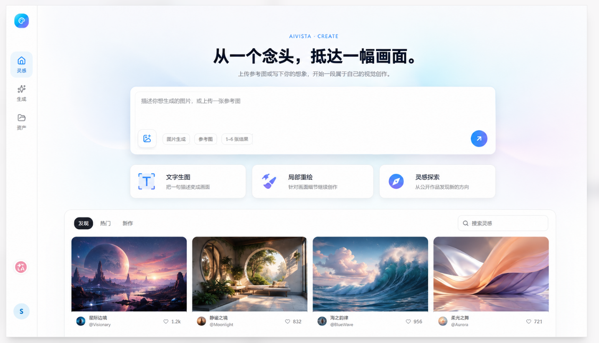
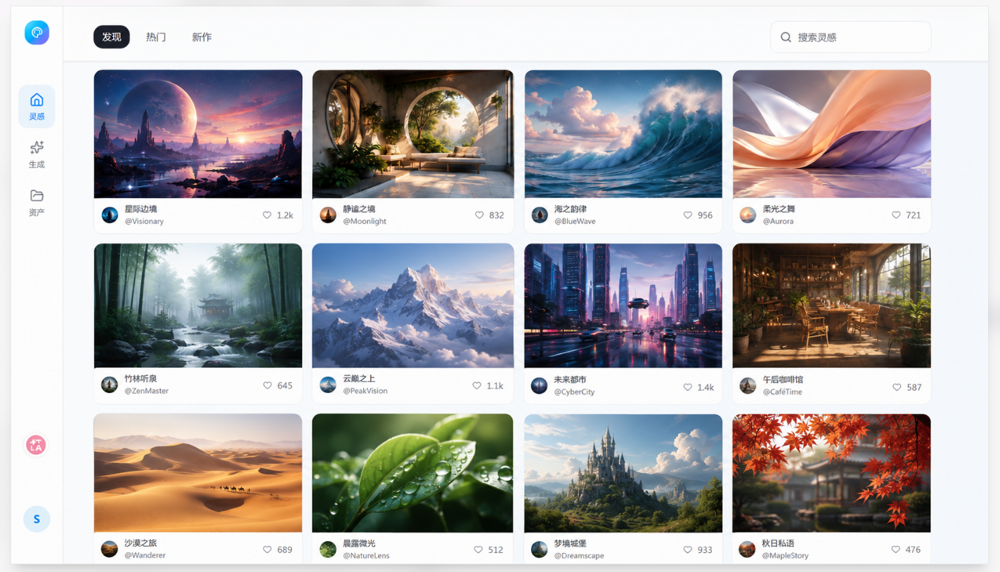

请根据我提供的两张 UI 参考图，高保真还原一个桌面端 AI 图片创作平台首页。参考图 1 表示页面默认状态，参考图 2 表示页面向下滚动后，“灵感作品区”顶部工具栏吸顶的状态。

目标是还原完整、可运行的网页，而不是简单生成一张静态图片。必须实现滚动交互、吸顶状态变化以及平滑的视觉衔接。


图1：




图2：



## 一、整体设计风格

- 产品名称：AIVISTA。
- 现代、克制、专业的 AI SaaS 风格。
- 页面采用暖白色背景，叠加非常浅的冰蓝色、淡紫色环境渐变。
- 主色为青蓝到蓝紫色渐变，正文使用深海军蓝或接近黑色。
- 避免霓虹风、重度毛玻璃、粗边框、深色主题和过度装饰。
- 统一采用 12px、16px、24px、32px 间距体系。
- 卡片圆角以 16～20px 为主。
- 阴影轻柔，主要用于表达层级，不要产生明显悬浮感。
- 中文字体清晰、克制，注意标题、正文和辅助信息的字号层级。

## 二、页面整体结构

页面由以下部分组成：

1. 固定左侧导航栏。
2. 页面顶部的 AI 图片生成 Hero 区域。
3. 提示词输入组件。
4. 三个创作功能入口卡片。
5. 灵感作品区。
6. 灵感作品区滚动后的吸顶工具栏。

页面采用桌面端布局，左侧导航固定，右侧内容区域独立滚动或随页面滚动。

## 三、左侧固定导航栏

- 宽度约 88～96px。
- 固定在页面左侧，高度为 `100vh`。
- 白色背景，右侧使用非常浅的分割线。
- 顶部显示 AIVISTA 渐变色 Logo。
- 中部依次显示：
  - 灵感
  - 生成
  - 资产
- 每项包含统一尺寸的线性图标和中文标签。
- 当前选中项“灵感”使用浅蓝色圆角背景，图标和文字使用品牌蓝色。
- 底部保留辅助功能按钮和用户头像。
- 所有图标保持统一的线宽、尺寸和视觉风格。

## 四、Hero 创作区域

Hero 区域不再使用一个巨大、边界明显的圆角矩形容器，避免出现过多空白。

使用轻量、无明显边框的背景区域，并添加非常克制的浅蓝色和淡紫色径向渐变，突出中心内容。

Hero 文案居中排列：

- 小标题：`AIVISTA · CREATE`
- 主标题：`从一个念头，抵达一幅画面。`
- 副标题：`上传参考图或写下你的想象，开始一段属于自己的视觉创作。`

主标题需要有较强的视觉重量，但不能过度粗大。副标题使用中性灰色。

## 五、提示词输入组件

提示词输入框是首屏最强的视觉焦点。

- 宽度约 960～1040px。
- 使用白色卡片背景。
- 圆角约 18～20px。
- 使用非常浅的边框和多层柔和阴影。
- 内部提供宽敞的多行输入区域。
- 占位文字：`描述你想生成的图片，或上传一张参考图`
- 左下角依次放置：
  - 上传图片按钮
  - `图片生成`
  - `参考图`
  - `1–6 张结果`
- 右下角放置蓝色渐变圆形发送按钮。
- 输入区域保持简洁，不要堆积过多控件。
- 输入框应明显高于普通表单控件，但不要占据过多首屏高度。

## 六、三个功能入口卡片

输入框下方横向排列三个等宽卡片：

1. `文字生图`
   - `把一句描述变成画面`
2. `局部重绘`
   - `针对画面细节继续创作`
3. `灵感探索`
   - `从公开作品发现新的方向`

每张卡片包含：

- 独立的蓝紫色简洁图标。
- 功能标题。
- 一行辅助说明。
- 浅边框、16px 左右圆角和轻微阴影。
- Hover 时可轻微上移，并增强阴影和边框颜色。
- 三张卡片整体高度和内部对齐方式必须一致。

## 七、灵感作品区默认状态

灵感区位于 Hero 区域下方。

默认状态下可以使用轻量内容容器，但不要使用过重的大卡片样式。

顶部工具栏包含：

- 左侧标签：
  - `发现`
  - `热门`
  - `新作`
- 当前选中的“发现”使用深海军蓝色紧凑胶囊背景和白色文字。
- 右侧为搜索框，占位文字：`搜索灵感`。

工具栏下方展示四列作品网格或瀑布流。

每张作品卡片包含：

- 高质量作品缩略图。
- 统一的 16px 左右圆角。
- 作品标题。
- 作者头像和名称。
- 点赞图标及数量。
- 卡片之间保持一致间距。
- 页面需要展示多行内容，使用户能够明确感知页面可以继续向下滚动。

工具栏、图片卡片和页面主体必须使用相同的左右内容边距，保持严格对齐。

## 八、滚动吸顶交互

这是页面还原的重点。

当用户向下滚动，灵感区顶部的标签和搜索框到达页面顶部时，需要吸附在顶部。

不要直接让整个带大圆角的灵感区容器吸顶，否则会出现圆角卡片突然贴到视口顶部的割裂感。

请将结构拆分为：

- `gallery-section`
- `gallery-toolbar`
- `gallery-grid`

只有 `gallery-toolbar` 使用 `position: sticky`，作品网格继续正常滚动。

建议：

```css
.gallery-toolbar {
  position: sticky;
  top: 0;
  z-index: 30;
}
```

如果页面顶部还存在其他固定导航，则根据实际高度调整 `top`。

## 九、吸顶前后的视觉状态

### 吸顶前

- 工具栏在视觉上属于灵感内容区域。
- 可以保留与内容容器一致的左右边距。
- 可以有轻微圆角，但不要过于突出。
- 工具栏下方与图片网格自然连接。

### 吸顶后

当工具栏到达页面顶部：

- 取消工具栏顶部圆角，使其与视口顶部自然连接。
- 不再显示灵感区外层大圆角边框。
- 工具栏变成约 68～72px 高的扁平白色顶栏。
- 背景使用白色或 `rgba(255,255,255,0.94)`。
- 可以添加轻微 `backdrop-filter: blur(12px)`。
- 底部增加非常浅的分割线。
- 添加轻柔的向下阴影，表达工具栏位于作品网格上层。
- 左侧标签和右侧搜索框的位置不能发生明显跳动。
- 工具栏内部内容宽度、左右边距必须与下方图片网格保持一致。
- 图片内容在工具栏下方滚动，不得透过工具栏显示。
- 吸顶时不要把工具栏设计成悬浮的圆角胶囊或独立卡片。

参考视觉参数：

```css
.gallery-toolbar {
  min-height: 72px;
  background: rgba(255, 255, 255, 0.94);
  border-bottom: 1px solid rgba(15, 23, 42, 0.08);
  box-shadow: 0 8px 24px rgba(15, 23, 42, 0.06);
  backdrop-filter: blur(12px);
}
```

## 十、吸顶状态切换

使用 `IntersectionObserver`、哨兵元素或滚动位置判断工具栏是否已经吸顶，并切换 `.is-stuck` 状态。

状态变化只允许调整以下视觉属性：

- 背景透明度。
- 圆角。
- 底部分割线。
- 阴影。
- 必要的左右延展范围。

不要改变工具栏内部元素的位置、字体大小或控件尺寸，避免吸顶瞬间产生跳动。

状态切换动画建议为：

```css
transition:
  background-color 180ms ease,
  box-shadow 180ms ease,
  border-radius 180ms ease,
  border-color 180ms ease;
```

必须避免：

- 工具栏吸顶时宽度突然变化。
- 标签和搜索框横向位移。
- 页面内容因工具栏脱离文档流而上下跳动。
- 大圆角容器直接撞到视口顶部。
- 图片从透明工具栏后方透出。
- 吸顶栏覆盖左侧固定导航。

## 十一、响应式要求

- 桌面端保持四列作品网格。
- 中等屏幕可以调整为三列。
- 小屏幕可以调整为两列或一列。
- 左侧导航和内容区域不能重叠。
- 搜索框在空间不足时可以缩短，但标签不应换行。
- 吸顶功能在不同屏幕宽度下都必须有效。

## 十二、还原要求

- 优先还原参考图的整体比例、留白、层级、色彩和交互逻辑。
- 不要擅自更换品牌名称、中文文案或主要导航结构。
- 不要添加参考图中不存在的大型模块。
- 作品图片可以使用高质量占位图片，但整体色调应与参考图协调。
- 所有按钮、标签、输入框都需要包含 Hover、Focus 和 Active 状态。
- 页面应可直接运行，并保证滚动吸顶过程平滑、无布局抖动。
- 最终结果需要同时匹配参考图 1 的默认状态和参考图 2 的吸顶状态。