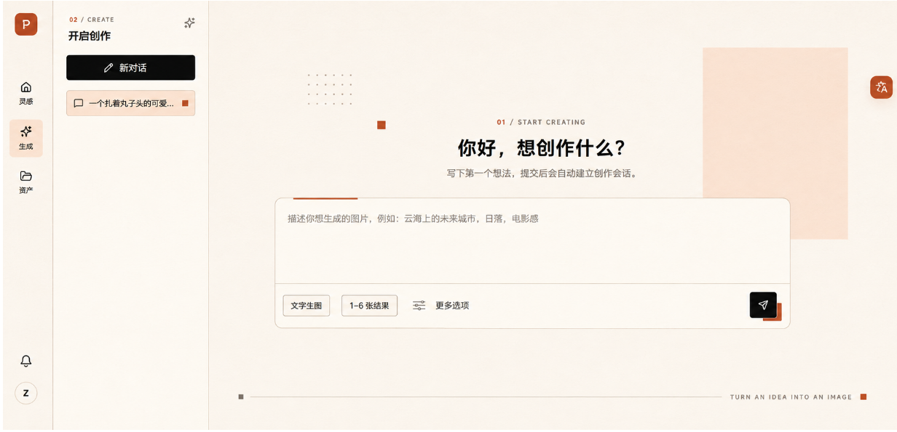
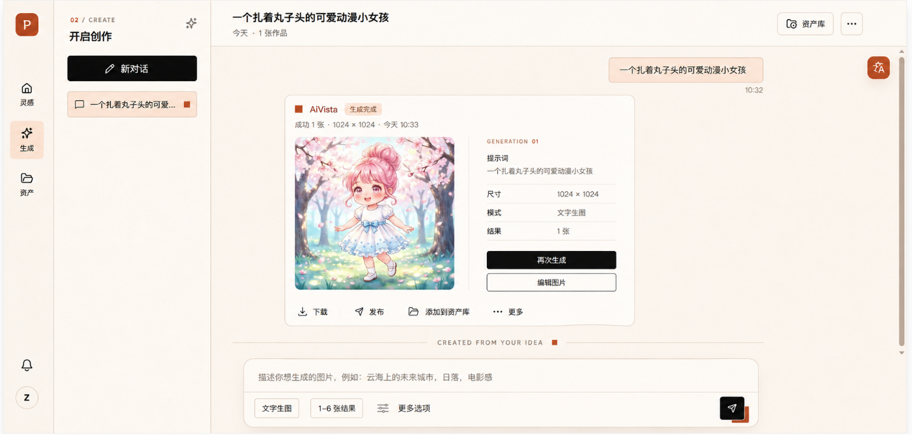

请基于当前已有的“生成/创作页面”，仅修改页面结构、布局和视觉样式。







现有功能、数据、交互行为和业务逻辑全部保持不变。不要修改接口、状态管理、路由和事件处理。

## 当前未提交实现同步（2026-08-25）

- 已实现 88px 全局主导航、会话侧栏与暖色创作工作区；新会话与已选会话复用同一生成能力，不改变会话、任务和 SSE 数据流。
- 已选会话中的输入框固定悬浮在工作区下方，不随消息滚动；离底部较远时收缩为单行胶囊，发送按钮位于胶囊内部右侧。输入内容可自动增高，但有高度上限。
- 已实现会话消息与生成结果卡片：生成数量按 1 张单图、2 张两列、3 张三列、4 张 2×2、5～6 张 3×2 布局；图片卡片悬浮操作与资产详情复用同一下载、复制和详情规则。
- 工作区的点阵和强调方块使用共享 `editorial-ornaments` 组件；这些装饰为相对定位的视觉层，不参与业务交互。

目标是复现一套与个人主页一致的暖色编辑排版风格：

- 暖米白页面背景
- 暖白色功能表面
- 浅杏色几何色块
- 接近黑色的标题和主按钮
- 少量陶土橙作为强调
- 使用细线、点阵、方块建立编辑排版感
- 不使用大幅背景图片
- 不使用蓝紫渐变
- 不使用玻璃拟态

## 1. 页面总体结构

页面采用三栏结构：

1. 左侧主导航栏
2. 中间会话侧边栏
3. 右侧创作工作区

建议整体关系：

```text
┌────────┬────────────────────────┬─────────────────────────────────────┐
│ 88px   │        320px           │             剩余空间                │
│ 主导航  │       会话侧栏          │             创作工作区              │
└────────┴────────────────────────┴─────────────────────────────────────┘
```

页面尺寸：

- 宽度：100vw
- 高度：100vh
- 最小高度：720px
- 页面背景：`#F5F0E6`
- 页面不出现横向滚动条
- 三个区域均占满视口高度

推荐布局：

```css
.page {
  display: grid;
  grid-template-columns: 88px 320px minmax(0, 1fr);
  width: 100vw;
  min-height: 100vh;
  background: #f5f0e6;
}
```

主导航栏和会话侧栏保持固定宽度，右侧工作区自适应剩余空间。

------

## 2. 页面颜色

整个页面只使用以下主要颜色：

```css
--page-bg: #f5f0e6;
--surface-bg: #fffdf7;
--surface-soft: #faf5eb;

--peach-light: #f7e3d4;
--peach: #f1d1bd;

--terracotta: #c95f3f;
--terracotta-dark: #ae4d33;

--ink: #171612;
--text-primary: #1b1a17;
--text-secondary: #716b61;
--text-muted: #9b9387;

--border: #d9cfbf;
--border-strong: #bfb3a2;
```

颜色使用比例：

- 米白、暖白：约80%
- 浅杏色：约12%
- 黑色：约6%
- 陶土橙：不超过4%

陶土橙只用于：

- 微型序号
- 小型装饰方块
- 输入框顶部短线
- 会话选中标记
- 发送按钮的底层偏移色块
- 少量重点状态

不要将陶土橙作为大面积背景。

------

## 3. 左侧主导航栏

主导航栏位于页面最左侧。

### 外层布局

- 宽度：88px
- 高度：100vh
- 背景：`#FFFDF7`
- 右侧边框：`1px solid #D9CFBF`
- 使用纵向 Flex 布局
- 顶部放Logo
- 中间放主要导航
- 底部放通知和用户头像
- `flex-shrink: 0`

### Logo区域

- Logo距离顶部：24px
- Logo水平居中
- Logo尺寸：42px × 42px
- 圆角：10px
- 可以保留现有品牌Logo

如果Logo本身带有蓝紫色，可以保留Logo原色，但蓝紫色不能扩散到其他页面元素。

### 导航区域

导航项保持现有顺序：

```text
灵感
生成
资产
```

导航区域建议位于页面顶部约150px处。

单个导航项：

- 宽度：64px
- 最小高度：68px
- 水平居中
- 使用纵向排列
- 图标位于上方
- 文字位于下方
- 图标与文字间距：6px
- 图标尺寸：21px
- 文字字号：13px
- 圆角：8px
- 导航项之间间距：12px

默认状态：

- 背景透明
- 图标颜色：`#4D4942`
- 文字颜色：`#4D4942`

当前“生成”选中状态：

- 背景：`#F7E3D4`
- 图标颜色：`#171612`
- 文字颜色：`#171612`
- 不使用蓝色背景
- 不使用左侧蓝色选中条

### 底部区域

底部区域固定在导航栏底部：

- 距离底部：24px
- 通知图标和头像纵向排列
- 两者间距：22px
- 水平居中

头像：

- 尺寸：42px × 42px
- 圆形
- 背景：`#FFFDF7`
- 边框：`1px solid #D9CFBF`
- 中间显示字母“Z”
- 文字颜色：`#171612`

------

## 4. 会话侧边栏

会话侧边栏位于主导航栏右侧。

### 外层尺寸

- 宽度：320px
- 高度：100vh
- 背景：`#FFFDF7`
- 右侧边框：`1px solid #D9CFBF`
- 内边距：30px 24px
- `overflow-y: auto`
- `flex-shrink: 0`

侧栏内部从上到下包括：

1. 微型栏目标题
2. 页面标题和右侧图标
3. 新对话按钮
4. 会话列表

------

## 5. 会话侧栏标题区

### 微型标题

在侧栏顶部显示：

```text
02 / CREATE
```

样式：

- 字号：11px
- 字重：600
- 字母间距：0.16em
- 行高：1
- `02` 使用陶土橙 `#C95F3F`
- `/ CREATE` 使用灰棕色 `#716B61`

位置：

- 距离侧栏顶部：4px
- 距离侧栏左侧：4px

### 主标题

显示：

```text
开启创作
```

样式：

- 距离微型标题：14px
- 字号：24px
- 字重：700
- 行高：1.2
- 颜色：`#171612`

标题右侧保留当前操作图标：

- 图标尺寸：20px
- 颜色：`#716B61`
- 与标题水平两端对齐
- 点击区域：36px × 36px

标题行使用：

```css
display: flex;
align-items: center;
justify-content: space-between;
```

------

## 6. 新对话按钮

新对话按钮位于标题下方。

位置：

- 距离标题：24px
- 宽度：100%
- 高度：52px

样式：

- 背景：`#171612`
- 文字：`#FFFDF7`
- 圆角：7px
- 不使用渐变
- 不使用胶囊造型
- 不使用明显阴影

内容布局：

- 左侧保留编辑图标
- 图标尺寸：18px
- 图标与文字间距：12px
- 文字字号：16px
- 字重：600
- 内容整体靠左
- 左内边距：28px

------

## 7. 会话列表

会话列表位于新对话按钮下方。

- 顶部间距：20px
- 会话之间间距：8px
- 使用纵向列表

单个会话项：

- 宽度：100%
- 高度：52px
- 圆角：7px
- 左右内边距：14px
- 使用水平Flex布局
- 垂直居中

默认会话：

- 背景透明
- 文字颜色：`#716B61`

选中会话：

- 背景：`#F7E3D4`
- 边框：`1px solid #DEBDA9`
- 文字颜色：`#171612`

会话项内部从左到右：

1. 会话图标
2. 会话名称
3. 陶土橙状态方块

会话图标：

- 尺寸：18px
- 颜色：`#171612`

会话名称：

- 左侧间距：10px
- 字号：14px
- 单行显示
- 超出省略
- 占据剩余宽度

选中状态方块：

- 尺寸：9px × 9px
- 背景：`#C95F3F`
- 不使用圆形
- 与会话项右侧保持12px距离

会话项不要使用蓝色背景或灰色大胶囊。

------

## 8. 右侧创作工作区

创作工作区占据剩余页面空间。

### 外层结构

- 高度：100vh
- 背景：`#F5F0E6`
- `position: relative`
- `overflow: hidden`
- 最小宽度：0

内部放置：

1. 背景装饰层
2. 中央创作区
3. 右侧翻译按钮
4. 底部编辑装饰线

中央创作内容使用正常布局定位，背景装饰使用绝对定位。

------

## 9. 背景装饰层

工作区不使用背景图片。

只使用纯CSS几何装饰。

### 右侧浅杏色块

在工作区右上偏中位置放置一个大型浅杏色矩形：

- `position: absolute`
- `top: 94px`
- `right: 105px`
- 宽度：290px
- 高度：390px
- 背景：`#F7E3D4`
- 不使用圆角
- `z-index: 0`

该色块应位于中央输入框后方，但不要覆盖文字的主要阅读区域。

色块只作为构图锚点，不能覆盖超过工作区面积的15%。

### 点阵装饰

在中央内容左上方放置点阵：

- `position: absolute`
- 距离工作区左侧约：200px
- 距离顶部约：150px
- 5列 × 3行
- 每个点：3px
- 点间距：10px
- 颜色：`#A99C8D`
- 透明度：55%

### 陶土橙小方块

在点阵右下方增加一个小方块：

- 尺寸：17px × 17px
- 背景：`#C95F3F`
- 与点阵保持约50px距离

装饰层要求：

```css
pointer-events: none;
user-select: none;
```

装饰元素必须位于主内容下方。

------

## 10. 中央创作区域

中央创作区域位于工作区的水平中心。

整体容器：

- 最大宽度：1040px
- 宽度：`calc(100% - 96px)`
- 水平居中
- `position: relative`
- `z-index: 1`
- 顶部距离视口约：235px

不要让创作区域严格垂直居中。它应该位于页面上半部分偏中位置，与设计稿保持一致。

容器内部依次为：

1. 微型栏目标题
2. 主标题
3. 副标题
4. 输入框

------

## 11. 中央微型栏目标题

显示：

```text
01 / START CREATING
```

样式：

- 水平居中
- 字号：11px
- 字重：600
- 字母间距：0.16em
- 行高：1
- `01` 使用陶土橙
- 其他部分使用灰棕色

与主标题间距：24px。

------

## 12. 主标题和副标题

主标题：

```text
你好，想创作什么？
```

样式：

- 水平居中
- 字号：38px
- 字重：700
- 行高：1.25
- 颜色：`#171612`
- 不使用渐变文字
- 不添加图标

副标题：

```text
写下第一个想法，提交后会自动建立创作会话。
```

样式：

- 距离标题：14px
- 水平居中
- 字号：15px
- 行高：1.6
- 颜色：`#716B61`

副标题与输入框之间间距：40px。

------

## 13. 创作输入框

输入框是工作区的核心视觉元素。

### 外层尺寸

- 宽度：100%
- 高度：264px
- 背景：`#FFFDF7`
- 边框：`1px solid #D9CFBF`
- 圆角：10px
- `overflow: hidden`
- 轻微阴影
- `position: relative`

建议阴影：

```css
box-shadow:
  0 2px 4px rgb(43 35 25 / 3%),
  0 16px 36px rgb(43 35 25 / 6%);
```

不要使用20px以上的大圆角。

### 顶部短线

输入框顶部左侧增加一条陶土橙短线：

- `position: absolute`
- `top: 0`
- `left: 36px`
- 宽度：130px
- 高度：3px
- 背景：`#C95F3F`

短线不要贯穿整个输入框。

------

## 14. 文本输入区域

输入框上半部分为文本输入区。

尺寸：

- 高度：176px
- 左右内边距：26px
- 上内边距：30px
- 下内边距：20px

输入区域背景：

- `#FFFDF7`
- 不使用单独边框
- 不使用内部阴影

占位文字：

```text
描述你想生成的图片，例如：云海上的未来城市，日落，电影感
```

样式：

- 字号：16px
- 行高：1.7
- 颜色：`#8C8377`
- 顶部对齐
- 左对齐

不要把占位文字放在垂直中央。

------

## 15. 输入框底部工具栏

文本输入区下方放置工具栏。

### 外层尺寸

- 高度：88px
- 上边框：`1px solid #D9CFBF`
- 左右内边距：16px
- 使用水平Flex布局
- 垂直居中
- 两端对齐
- 背景：`#FFFDF7`

工具栏分为：

- 左侧参数区域
- 右侧发送按钮

------

## 16. 左侧参数区域

左侧包含：

```text
文字生图
1–6 张结果
更多选项
```

使用水平Flex排列：

- 垂直居中
- 元素之间间距：14px

### 参数按钮

“文字生图”和“1–6 张结果”使用小型矩形按钮。

尺寸：

- 高度：42px
- 水平内边距：16px
- 圆角：6px
- 背景：`#FFFDF7`
- 边框：`1px solid #BFB3A2`
- 文字颜色：`#171612`
- 字号：14px

不要使用胶囊式圆角。

### 更多选项

“更多选项”保持文字按钮形式：

- 高度：42px
- 水平内边距：12px
- 背景透明
- 无边框
- 图标与文字间距：10px
- 图标尺寸：19px
- 字号：15px
- 颜色：`#171612`

------

## 17. 发送按钮

发送按钮位于工具栏右侧。

主按钮：

- 尺寸：52px × 52px
- 背景：`#171612`
- 圆角：7px
- 不使用圆形
- 不使用蓝色
- 不使用渐变
- 白色或暖白色纸飞机图标
- 图标尺寸：21px
- `position: relative`
- `z-index: 2`

在主按钮后面增加一个陶土橙偏移方块：

- 尺寸：38px × 38px
- 背景：`#C95F3F`
- 圆角：3px
- 位于主按钮右下方
- 水平偏移：10px
- 垂直偏移：10px
- `z-index: 1`

这两个元素构成错位的编辑排版效果。

不要给发送按钮添加蓝紫色发光阴影。

------

## 18. 右侧翻译按钮

保留页面右侧悬浮翻译按钮。

位置：

- `position: fixed`
- 距离右侧：16px
- 距离顶部：152px

尺寸：

- 48px × 48px
- 圆角：10px
- 背景：`#C95F3F`
- 图标颜色：`#FFFDF7`
- 图标尺寸：21px
- 阴影保持轻微

不要使用粉色或蓝紫渐变。

------

## 19. 底部编辑装饰线

在工作区底部增加一条装饰线。

位置：

- `position: absolute`
- 左侧：60px
- 右侧：60px
- 底部：58px
- 高度：16px

结构从左到右为：

1. 灰棕色小方块
2. 水平细线
3. 英文微型文字
4. 陶土橙小方块

左侧小方块：

- 8px × 8px
- 背景：`#716B61`

水平线：

- 高度：1px
- 自动占据剩余空间
- 背景：`#BFB3A2`
- 左右间距：14px

英文文字：

```text
TURN AN IDEA INTO AN IMAGE
```

样式：

- 字号：10px
- 字重：500
- 字母间距：0.18em
- 颜色：`#716B61`
- 不换行

右侧小方块：

- 8px × 8px
- 背景：`#C95F3F`
- 与英文间距：14px

------

## 20. 圆角规则

整个页面统一使用克制的小圆角：

- 主输入框：10px
- 会话按钮：7px
- 参数按钮：6px
- 导航选中项：8px
- 翻译按钮：10px
- 发送按钮：7px

不要使用超过12px的大圆角。

以下元素保持直角：

- 右侧浅杏色背景色块
- 点阵
- 陶土橙装饰方块
- 底部装饰方块

------

## 21. 阴影规则

只允许以下元素使用阴影：

- 中央创作输入框
- 翻译悬浮按钮
- 必要的悬浮状态

主导航、会话侧栏、导航项、会话项不使用明显阴影。

阴影颜色使用暖黑色低透明度，不使用蓝色或紫色阴影。

------

## 22. 1920px桌面布局基准

在1920 × 920左右的桌面视口下：

- 主导航宽度：88px
- 会话侧栏宽度：320px
- 工作区宽度：约1512px
- 中央创作容器宽度：1040px
- 中央创作容器左侧约位于工作区中心
- 微型标题顶部约：240px
- 主标题顶部约：278px
- 输入框顶部约：399px
- 输入框高度：264px
- 底部装饰线距离底部约：58px

中央输入框不能过宽，不要铺满工作区。

------

## 23. 中等屏幕布局

当工作区宽度变小时：

- 会话侧栏宽度可缩小到280px
- 创作容器宽度改为 `calc(100% - 64px)`
- 最大宽度仍保持1040px
- 主标题字号降为32px
- 右侧浅杏色块宽度缩小
- 输入框高度保持220px以上
- 底部装饰线左右距离缩小到32px

不要让输入框贴近会话侧栏或视口右边缘。

------

## 24. 小屏幕布局

当页面宽度小于900px时：

- 会话侧栏可以收起或使用项目现有折叠方式
- 主导航保持当前项目已有移动端策略
- 工作区左右内边距：20px
- 创作区域顶部距离缩小
- 主标题字号：28px
- 输入框宽度：100%
- 输入框底部工具栏允许换行
- 翻译按钮保持贴近右侧
- 隐藏右侧大型浅杏色色块
- 隐藏底部英文装饰线
- 保留必要的小型陶土橙装饰

------

## 25. 布局实现限制

必须遵守以下要求：

- 主要三栏结构使用Grid或Flex实现
- 中央内容使用正常文档流布局
- 不使用绝对定位完成中央输入框的主要布局
- 绝对定位仅用于浅杏色块、点阵、小方块和底部装饰
- 不使用背景图片
- 不使用SVG大面积背景
- 不使用蓝紫渐变
- 不使用玻璃拟态
- 不使用霓虹光效
- 不使用巨大圆角
- 不使用大面积纯白背景
- 不增加无业务含义的卡片
- 不改变现有功能入口和文字
- 不改变会话侧栏与创作区域的层级关系

最终页面应呈现为：左侧结构清晰、中央创作入口突出、背景留白克制但不空洞，通过暖米白、浅杏色块、细线、点阵和陶土橙小方块建立与个人主页一致的编辑排版风格。
