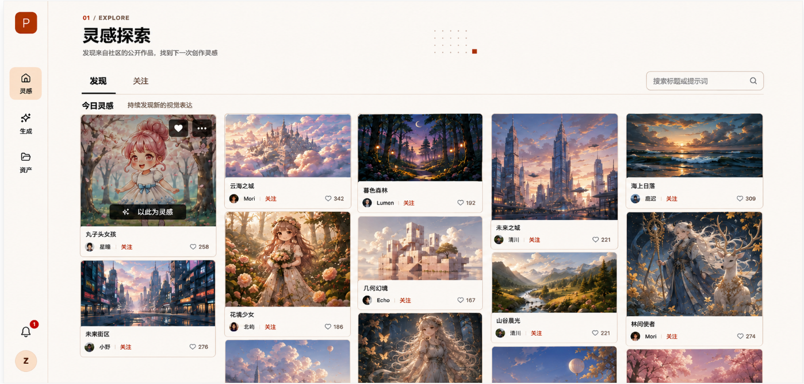

请基于当前已有的灵感探索页面，仅修改页面结构、布局和视觉样式。

现有功能、接口、状态、搜索、关注、点赞和页面跳转逻辑全部保留。本次不重新实现业务功能，只调整DOM结构和CSS。

## 当前未提交实现同步（2026-08-25）

- 已采用本文的暖色页面头部、发现/关注导航、搜索框、分区标题及“图片 + 信息底座”卡片结构；全局 88px 左侧主导航由应用壳层统一提供。
- 瀑布流不是 CSS Columns。实际内容使用共享的 `ShortestLaneFeed` 最短车道组件：按服务端返回顺序依次把下一张图放入当前最短车道，不对已加载项重排；最大 5 列，车道与卡片间距均为 18px。发现与搜索结果复用此组件。
- 当前公开列表 DTO 只有标题、点赞数与 `authorId`。卡片信息底座已实现“标题 + 点赞”；作者头像、昵称和关注行未实现，避免为每张卡片发起作者资料请求。
- 悬浮层中的收藏、更多图标目前是视觉占位，因公开列表尚无对应的收藏/更多操作接口；“以此为灵感”可跳转至 `/generate`，但不会伪造或复制提示词。
- 卡片图片使用 `thumbnail` 懒加载；打开详情复用当前项的 `display`。读取失败时最多刷新该单图一次；原图下载不在公开 DTO 中，且只允许认证作者从专属接口取得。
- 灵感与个人主页共用 `WorkPreviewCardSurface`、`WorkPreviewCardImage`、`WorkPreviewCardInfoBar` 和 `WorkPreviewCardLikes`：相同的 8px 圆角、边框、阴影、真实图片比例与 52px 标题/点赞底座。灵感页仅在图片区域叠加其专属悬浮操作。

页面最终结构：

```text
灵感探索页面
├── 左侧主导航
└── 主内容区
    ├── 页面头部
    │   ├── 微型栏目标题
    │   ├── 页面标题
    │   ├── 页面说明
    │   └── 几何装饰
    ├── 探索导航
    │   ├── 发现
    │   ├── 关注
    │   └── 搜索框
    ├── 内容分区标题
    └── 作品瀑布流
        └── 作品卡片
            ├── 图片区域
            │   └── 悬浮操作
            └── 信息底座
                ├── 标题与点赞
                └── 作者与关注
```

页面不包含：

- 推荐、人物、场景、插画、摄影等分类按钮
- 排序控件
- 状态筛选
- 网格/列表切换
- 右侧悬浮翻译按钮
- 大幅背景图片
- 作品技术参数

# 一、整体视觉风格

页面延续其他页面的暖色编辑排版风格：

- 暖米白页面背景
- 暖白色作品卡片
- 接近黑色的主要文字
- 浅杏色导航选中状态
- 少量陶土橙用于关注和装饰
- 使用细线、点阵和小方块建立排版层级
- 作品区域强调图片本身
- 圆角和阴影保持克制

统一颜色：

```css
:root {
  --page-bg: #f5f0e6;
  --surface-bg: #fffdf7;
  --surface-soft: #faf5eb;

  --peach-light: #f7e3d4;
  --peach: #f1d1bd;

  --terracotta: #c95f3f;
  --terracotta-dark: #ae4d33;

  --ink: #171612;
  --text-primary: #1b1a17;
  --text-secondary: #716b61;
  --text-muted: #9b9387;

  --border: #d9cfbf;
  --border-strong: #bfb3a2;
}
```

禁止使用：

- 蓝色选中状态
- 蓝紫渐变
- 玻璃拟态
- 霓虹发光
- 大面积纯白背景
- 超大圆角
- 厚重卡片阴影
- 商品列表式卡片风格

------

# 二、页面整体布局

页面采用“固定左侧导航 + 主内容区”的结构。

```text
┌────────┬──────────────────────────────────────────┐
│ 88px   │                 主内容区                  │
│ 主导航  │                                          │
└────────┴──────────────────────────────────────────┘
```

页面根节点：

```css
.explore-page {
  display: grid;
  grid-template-columns: 88px minmax(0, 1fr);
  width: 100vw;
  min-height: 100vh;
  background: var(--page-bg);
}
```

主内容区：

```css
.explore-main {
  min-width: 0;
  min-height: 100vh;
  padding: 34px 48px 64px;
}
```

内容容器：

```css
.explore-container {
  width: 100%;
  max-width: 1640px;
  margin: 0 auto;
}
```

在1920px桌面视口下：

- 左侧导航：88px
- 主内容左右内边距：48px
- 主内容最大宽度：1640px
- 内容水平居中
- 页面垂直滚动由主内容区承担

------

# 三、左侧主导航

左侧导航与个人资产页、AI创作页保持一致。

外层：

- 宽度：88px
- 高度：100vh
- 固定在视口左侧
- 背景：`#FFFDF7`
- 右侧边框：`1px solid #D9CFBF`
- 使用纵向Flex布局
- 顶部放Logo
- 中部放导航项
- 底部放通知和头像

导航保留：

```text
灵感
生成
资产
```

单个导航项：

- 宽度：64px
- 高度：68px
- 图标和文字纵向排列
- 图标尺寸：21px
- 字号：13px
- 图标与文字间距：6px
- 圆角：8px
- 导航项间距：12px

当前“灵感”选中状态：

- 背景：`#F7E3D4`
- 图标颜色：`#171612`
- 文字颜色：`#171612`

不使用蓝色背景和蓝色选中线。

------

# 四、页面头部

页面头部位于主内容区顶部。

外层：

```css
.explore-header {
  position: relative;
  min-height: 126px;
}
```

头部不添加完整卡片背景，不使用背景图片。

内容从上到下依次为：

1. 微型栏目标题
2. 页面主标题
3. 页面说明

## 4.1 微型栏目标题

显示：

```text
01 / EXPLORE
```

样式：

- 字号：11px
- 字重：600
- 字母间距：0.16em
- `01`使用陶土橙
- `/ EXPLORE`使用灰棕色

## 4.2 页面主标题

显示：

```text
灵感探索
```

样式：

- 距离微型标题：14px
- 字号：36px
- 字重：700
- 行高：1.2
- 颜色：`#171612`

## 4.3 页面说明

显示：

```text
发现来自社区的公开作品，找到下一次创作灵感
```

样式：

- 距离主标题：12px
- 字号：15px
- 行高：1.6
- 颜色：`#716B61`

## 4.4 头部装饰

在头部中间偏右位置增加小范围点阵：

- 5列 × 3行
- 点尺寸：3px
- 点间距：10px
- 颜色：`#A99C8D`
- 透明度：40%

点阵右下方增加陶土橙方块：

- 14px × 14px
- 背景：`#C95F3F`

装饰元素必须：

```css
pointer-events: none;
user-select: none;
```

------

# 五、探索导航

探索导航位于页面头部下方。

外层：

```css
.explore-toolbar {
  display: flex;
  align-items: flex-end;
  justify-content: space-between;
  height: 62px;
  border-bottom: 1px solid var(--border);
}
```

探索导航只包含：

- 左侧“发现、关注”
- 右侧搜索框

中间不放任何分类按钮。

## 5.1 左侧标签

标签：

```text
发现
关注
```

标签容器：

```css
.explore-tabs {
  display: flex;
  align-items: stretch;
  height: 100%;
  gap: 40px;
}
```

单个标签：

- 高度占满导航行
- 使用Flex垂直居中
- 字号：17px
- 颜色：`#716B61`
- `position: relative`

激活的“发现”：

- 颜色：`#171612`
- 字重：600

底部激活线：

- 高度：2px
- 背景：`#171612`
- 宽度与文字接近
- 位于标签底部
- 不使用蓝色

## 5.2 搜索框

搜索框位于探索导航最右侧。

尺寸：

- 宽度：300px
- 高度：42px
- 距离导航底部：10px

样式：

- 背景：`#FFFDF7`
- 边框：`1px solid #D9CFBF`
- 圆角：7px
- 左内边距：16px
- 右内边距：42px

占位文字：

```text
搜索标题或提示词
```

样式：

- 字号：14px
- 颜色：`#9B9387`

搜索图标：

- 位于右侧
- 距离右边：14px
- 尺寸：18px
- 颜色：`#716B61`

------

# 六、内容分区标题

探索导航下方显示内容分区标题。

外层：

```css
.inspiration-section-header {
  display: flex;
  align-items: center;
  width: 100%;
  margin-top: 18px;
  margin-bottom: 12px;
}
```

左侧主标题：

```text
今日灵感
```

- 字号：18px
- 字重：700
- 颜色：`#171612`
- 不换行

副标题：

```text
持续发现新的视觉表达
```

- 左侧间距：30px
- 字号：13px
- 颜色：`#716B61`
- 不换行

副标题后方可以增加水平细线：

- 左侧间距：18px
- 自动占据剩余空间
- 高度：1px
- 背景：`#D9CFBF`

细线末尾放置陶土橙小方块：

- 8px × 8px
- 背景：`#C95F3F`
- 左侧间距：16px

------

# 七、真正的瀑布流布局

作品区域必须实现真正的瀑布流。

要求：

- 固定等宽列
- 每一列独立从上到下排列
- 下一张卡片紧跟当前列上一张卡片
- 不存在共享行高
- 相邻列的第二张、第三张卡片起始高度不同
- 图片保留原始宽高比
- 不为矮图片预留与高图片相同的行高

不要使用普通CSS Grid：

```css
/* 不要这样实现 */
display: grid;
grid-template-columns: repeat(5, 1fr);
```

因为普通Grid会形成共享行高，不是真正的瀑布流。

## 7.1 已确认实现方案：最短车道分配

保留项目当前的 JavaScript 最短车道算法：每次服务端返回新图片时，前端计算各等宽车道的当前高度，并将下一张图片放入最短车道。这样既保留服务端返回顺序，又能让无限加载后的列高持续均衡。

不使用 CSS Columns。Columns 会按列优先流动，不能保证“下一张图片进入当前最短车道”，也会改变服务端排序在视觉上的阅读顺序。

实现要求：

- 车道数量按本节断点规则变化；
- 车道宽度一致、间距为 18px（对应断点可缩小）；
- 卡片高度以 `图片实际比例 + 信息底座高度` 参与车道高度计算；
- 新页结果只追加到已有最短车道，不重排已经展示的图片；
- 卡片仍是完整不可拆分单元，包括图片和信息底座。

## 7.2 列数规则

桌面端：

- ≥1600px：5列
- 1280px～1599px：4列
- 1024px～1279px：3列
- 768px～1023px：2列
- <768px：2列
- <480px：1列

推荐：

```css
.inspiration-waterfall {
  column-count: 5;
  column-gap: 18px;
}

@media (max-width: 1599px) {
  .inspiration-waterfall {
    column-count: 4;
  }
}

@media (max-width: 1279px) {
  .inspiration-waterfall {
    column-count: 3;
  }
}

@media (max-width: 1023px) {
  .inspiration-waterfall {
    column-count: 2;
  }
}

@media (max-width: 479px) {
  .inspiration-waterfall {
    column-count: 1;
  }
}
```

------

# 八、图片比例

瀑布流图片不统一高度。

允许的常见比例：

- 2:3竖图
- 4:5竖图
- 1:1方图
- 4:3横图
- 16:10横图

图片宽度始终等于当前列宽。

图片高度根据原图比例自然计算：

```css
.inspiration-card__image {
  display: block;
  width: 100%;
  height: auto;
  object-fit: cover;
}
```

如果后端已提供图片宽高，容器应提前根据比例占位，避免加载时发生布局跳动。

不能强制所有图片使用统一的：

```css
aspect-ratio: 1 / 1;
```

------

# 九、作品卡片整体结构

每个瀑布流项目必须是一个完整作品卡片。

结构：

```text
InspirationCard
├── ImageArea
│   ├── Image
│   └── HoverOverlay
└── InfoPanel
    └── TitleRow
        ├── Title
        └── Like
```

卡片外层：

```css
.inspiration-card {
  display: inline-block;
  width: 100%;
  margin-bottom: 18px;
  overflow: hidden;
  break-inside: avoid;
  background: var(--surface-bg);
  border: 1px solid var(--border);
  border-radius: 8px;
  box-shadow:
    0 1px 2px rgb(43 35 25 / 3%),
    0 6px 16px rgb(43 35 25 / 3%);
}
```

图片和信息区必须：

- 共用一个外层边框
- 宽度完全一致
- 中间无空隙
- 整体共同参与瀑布流高度计算

不要将标题、作者和点赞放在卡片外部。

------

# 十、图片区域

图片容器：

```css
.inspiration-card__media {
  position: relative;
  width: 100%;
  overflow: hidden;
  background: var(--surface-soft);
}
```

图片：

```css
.inspiration-card__image {
  display: block;
  width: 100%;
  height: auto;
}
```

图片顶部圆角由外层卡片的`overflow: hidden`统一处理。

图片自身不再添加独立圆角和边框。

图片与信息区之间增加分隔线：

```css
.inspiration-card__info {
  border-top: 1px solid var(--border);
}
```

------

# 十一、信息底座

信息区紧贴在图片下方。

```css
.inspiration-card__info {
  width: 100%;
  padding: 12px 13px 13px;
  background: var(--surface-bg);
  border-top: 1px solid var(--border);
}
```

信息区不与图片之间留margin。

当前公开列表 DTO 仅提供作品标题、点赞数和 `authorId`，没有作者昵称、头像和当前用户关注状态。为避免逐卡请求作者资料产生 N+1 请求，本轮信息区只显示标题与点赞；作者行等待后端提供批量或内嵌作者摘要后再补充。

## 11.1 标题行

```css
.inspiration-card__title-row {
  display: flex;
  align-items: center;
  justify-content: space-between;
  gap: 12px;
  min-width: 0;
}
```

标题：

- 字号：15px
- 字重：600
- 颜色：`#171612`
- 单行显示
- 超出省略
- 占据剩余宽度

```css
.inspiration-card__title {
  flex: 1;
  min-width: 0;
  overflow: hidden;
  white-space: nowrap;
  text-overflow: ellipsis;
}
```

点赞：

- 心形图标尺寸：16px
- 点赞数字字号：13px
- 颜色：`#716B61`
- 图标与数字间距：5px
- 不压缩标题

## 11.2 作者行（后续接口补充后实施）

作者行距离标题行：

- 9px

```css
.inspiration-card__creator-row {
  display: flex;
  align-items: center;
  min-width: 0;
}
```

作者头像：

- 24px × 24px
- 圆形
- `object-fit: cover`
- 不收缩

作者名称：

- 左侧间距：8px
- 字号：13px
- 颜色：`#171612`
- 单行省略
- 最大宽度约100px

作者名称与关注之间增加分隔：

- 可以使用1px竖线
- 高度：12px
- 左右间距：10px
- 颜色：`#D9CFBF`

关注：

```text
关注
```

- 字号：13px
- 颜色：`#C95F3F`
- 背景透明
- 不添加胶囊背景

------

# 十二、作品悬浮状态

默认状态：

- 图片上不显示遮罩
- 不显示操作按钮
- 信息区保持正常显示

鼠标悬浮卡片时：

- 图片向上移动不超过2px，或者保持不移动
- 卡片阴影轻微增强
- 不整体缩放

```css
.inspiration-card {
  transition:
    transform 160ms ease,
    box-shadow 160ms ease;
}

.inspiration-card:hover {
  transform: translateY(-2px);
  box-shadow:
    0 2px 4px rgb(43 35 25 / 4%),
    0 14px 28px rgb(43 35 25 / 8%);
}
```

------

# 十三、图片悬浮遮罩

遮罩只覆盖图片区域，不能覆盖信息底座。

```css
.inspiration-card__overlay {
  position: absolute;
  inset: 0;
  background: rgba(23, 22, 18, 0.28);
  opacity: 0;
  transition: opacity 160ms ease;
}
```

悬浮时：

```css
.inspiration-card__media:hover .inspiration-card__overlay {
  opacity: 1;
}
```

## 13.1 右上角按钮

右上角显示：

1. 收藏
2. 更多

按钮：

- 36px × 36px
- 背景：`rgba(23, 22, 18, 0.88)`
- 图标：`#FFFDF7`
- 圆角：6px
- 两个按钮间距：8px
- 距离顶部：12px
- 距离右侧：12px

## 13.2 “以此为灵感”

按钮位于图片底部中央。

文字：

```text
以此为灵感
```

位置：

- 距离图片底部：14px
- 水平居中

样式：

- 高度：38px
- 水平内边距：18px
- 背景：`rgba(23, 22, 18, 0.92)`
- 文字：`#FFFDF7`
- 圆角：7px
- 图标尺寸：16px
- 图标与文字间距：8px

公开作品不显示：

- 下载
- 发布
- 编辑
- 删除
- 生成参数

------

# 十四、信息归属要求

必须保证用户能够立即判断信息属于哪张图片。

因此必须遵守：

- 图片和信息区共用一个外层容器
- 图片和信息区共用同一边框
- 信息区紧贴图片
- 图片和信息区之间只使用1px分隔线
- 标题、作者、关注和点赞全部位于卡片内部
- 下一张作品与当前作品之间保持18px明确间距
- 不允许信息漂浮在页面背景上
- 不允许点赞数字单独靠近下一张图片
- 不允许作者信息超出卡片宽度

正确关系：

```text
┌─────────────────────┐
│                     │
│        图片          │
│                     │
├─────────────────────┤
│ 标题          ♡ 258 │
│ 头像 作者 │ 关注     │
└─────────────────────┘
          18px
┌─────────────────────┐
│      下一张图片      │
```

------

# 十五、发现与关注状态

“发现”和“关注”共用同一页面结构。

发现状态：

- 展示社区推荐作品
- “发现”标签激活

关注状态：

- 展示已关注作者的作品
- “关注”标签激活

切换状态时：

- 标题区不变化
- 搜索框位置不变化
- 瀑布流列宽不变化
- 只替换数据内容
- 不重新设计另一套布局

关注内容为空时，显示空状态，不显示虚假作品。

------

# 十六、空状态

无作品时不渲染瀑布流列。

空状态：

- 最大宽度：420px
- 水平居中
- 距离内容分区标题约96px
- 纵向布局

使用纯CSS几何图标：

- 两个错位空心矩形
- 一个陶土橙方块
- 一个黑色四角星

发现为空：

```text
暂时没有公开作品
```

关注为空：

```text
还没有关注的创作者
```

说明文字：

```text
发现喜欢的创作者后，他们的作品会出现在这里
```

不要使用图片插画。

------

# 十七、加载状态

加载时保留瀑布流列宽。

Skeleton需要使用不同高度，模拟真实瀑布流：

- 竖图Skeleton
- 方图Skeleton
- 横图Skeleton
- 信息区Skeleton

不要将所有Skeleton设置成同一高度。

加载新页时，将Skeleton追加在各列底部，不使用全屏遮罩。

------

# 十八、无限加载布局

继续加载数据时：

- 新作品追加到瀑布流末尾
- 不清空现有内容
- 不改变已有列宽
- 不导致页面水平跳动
- 底部加载提示水平居中
- 加载提示位于所有瀑布流内容下方

底部状态：

```text
正在加载更多
```

到底状态：

```text
已经看到全部作品
```

------

# 十九、响应式布局

## ≥1600px

- 主内容左右内边距：48px
- 瀑布流：5列
- 列间距：18px

## 1280px～1599px

- 主内容左右内边距：40px
- 瀑布流：4列
- 列间距：18px

## 1024px～1279px

- 主内容左右内边距：28px
- 瀑布流：3列
- 搜索框宽度：260px

## 768px～1023px

- 使用项目已有导航折叠方案
- 主内容左右内边距：20px
- 瀑布流：2列
- 探索导航允许搜索框下一行显示
- 搜索框宽度：100%

## <768px

- 主内容左右内边距：16px
- 页面标题字号：30px
- 瀑布流：2列
- 列间距：12px
- 卡片信息区内边距：10px
- 作者名称最大宽度缩小
- “关注”可以只显示文字

## <480px

- 瀑布流：1列
- 搜索框宽度：100%
- 页面头部装饰隐藏
- 图片悬浮操作改为点击触发

------

# 二十、实现限制

必须遵守：

- 使用真正的瀑布流，不使用共享行高的普通Grid
- 每个作品卡片必须整体`break-inside: avoid`
- 图片保持原始宽高比
- 图片和信息底座必须属于同一个卡片
- 不显示分类按钮
- 不增加排序和筛选
- 不增加视图切换
- 不增加浮动翻译按钮
- 不展示生成参数
- 不修改现有功能和数据
- 不修改详情页跳转逻辑
- 不给公开作品增加下载或发布操作
- 绝对定位仅用于图片悬浮操作和页面装饰
- 保证长标题和长作者名不会撑破卡片

最终页面应呈现为：

```text
固定左侧导航
└── 主内容区
    ├── 编辑式页面头部
    ├── 发现/关注 + 搜索
    ├── 今日灵感分区标题
    └── 五列独立瀑布流
        └── 完整作品卡片
            ├── 不同宽高比图片
            │   └── 悬浮：收藏、更多、以此为灵感
            └── 紧贴信息底座
                ├── 标题 + 点赞
                └── 作者 + 关注
```

最终效果应与其他页面保持统一：暖米白背景、黑色标题、浅杏色选中状态、陶土橙强调、清晰的信息归属和真正高低错落的作品瀑布流。
