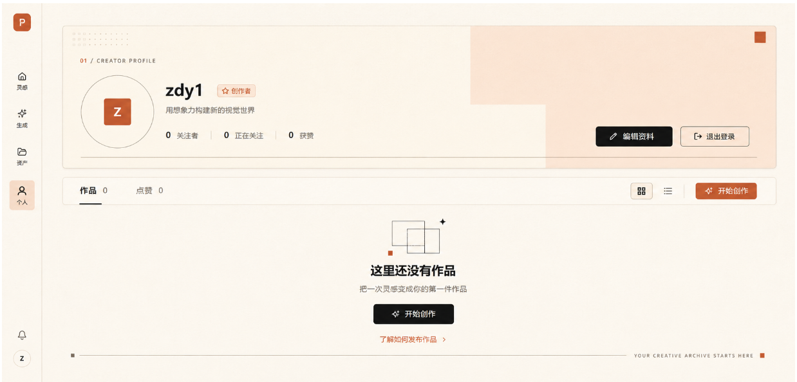

请基于当前已有页面，仅改造个人主页的 UI。所有功能、数据、交互和业务逻辑保持不变。

## 当前未提交实现同步（2026-08-25）

- 已实现暖色资料 Hero、共享的点阵/强调方块装饰、作品/点赞页签和同一主内容区；页面不再保留本人专属“发布区”。
- 本人“作品”只包含 `PENDING` 与 `APPROVED`：审核中的作品与已公开作品一起展示，仅在卡片右上角标记“审核中”；未提交发布的私有资产、`REJECTED` 与 `FAILED` 不出现在该页签。
- 访问者差异仅来自权限与数据：本人可编辑资料、管理点赞公开性并看到自己的审核中作品；他人只能看到公开作品及允许公开的点赞列表。
- 列表卡片使用 `thumbnail`，详情复用 `display`；原图下载遵循认证作者专属下载接口，不由主页列表下发。
- “作品”和“点赞”均使用共享的 `ShortestLaneFeed` 最短车道组件：按接口返回顺序逐项投入当前最短车道，最大 5 列、默认间距 18px。卡片按图片真实宽高比展示，标题信息区保持单行截断和固定高度，确保布局高度可确定。
- 已公开作品、点赞作品与灵感页复用同一套 `WorkPreviewCard` 小卡片视觉：8px 圆角、暖白表面、细边框、克制阴影及 52px 的“标题 + 点赞”信息底座。审核中作品复用相同外观，但以右上角“审核中”标记替代点赞内容；详情入口和悬浮操作仍由主页负责。



目标是复现一种“暖色编辑排版风格”的创作者个人主页。页面主要使用米白背景、浅杏色色块、黑色文字和陶土橙点缀，不使用大幅背景图片。

## 1. 页面整体布局

页面采用“固定左侧导航 + 右侧主内容”的结构。

### 左侧导航

- 固定在视口左侧
- 宽度：88px
- 高度：100vh
- 背景：`#FFFDF7`
- 右侧边框：`1px solid #DDD3C3`
- 内部保持当前导航项顺序
- Logo 位于顶部
- 主要导航位于中上部
- 通知与用户头像固定在底部

### 主内容区

- 左侧避开 88px 导航栏
- 页面背景：`#F5F0E6`
- 内边距：`32px 48px`
- 最大内容宽度：1680px
- 内容水平居中
- 各模块纵向间距：20px

页面从上到下分为：

1. 用户资料 Hero
2. 作品工具栏
3. 作品内容区或空状态

不要继续使用“左侧个人资料卡 + 右侧内容”的双栏结构。

------

## 2. 用户资料 Hero

Hero 位于主内容区顶部。

### 外层尺寸

- 宽度：100%
- 高度：320px
- 背景：`#FFFDF7`
- 边框：`1px solid #D9CFBF`
- 圆角：12px
- 轻微阴影
- `position: relative`
- `overflow: hidden`
- 内边距：48px

Hero 内部由三层组成：

1. 背景装饰层
2. 用户信息层
3. 操作按钮层

### 背景装饰

不要使用背景图片。

使用纯 CSS 色块：

- Hero 右上方放置一个浅杏色矩形
- 矩形宽度约占 Hero 的 42%
- 矩形高度约占 Hero 的 58%
- 背景色：`#F7E3D4`
- 保持直角，不使用圆形或波浪

右下方再增加一个浅色矩形：

- 从 Hero 宽度约 65% 的位置开始
- 延伸至右边界
- 高度约占 Hero 的 42%
- 背景色：`#F1D1BD`
- 透明度约 45%

Hero 右上角放置一个小型陶土橙方块：

- 尺寸：22px × 22px
- 距离顶部：16px
- 距离右侧：24px
- 背景色：`#C95F3F`

Hero 左上角增加小范围点阵：

- 5列 × 3行
- 每个点约 3px
- 点间距 7px
- 颜色：`#C95F3F`
- 透明度：25%

Hero 底部增加一条细线：

- 左右距离：40px
- 距离底部：24px
- 高度：1px
- 背景色：`#BFB3A2`

所有装饰元素都位于内容下层，不能遮挡文字和按钮。

------

## 3. Hero 微型栏目标题

在 Hero 左上方放置：

```text
01 / CREATOR PROFILE
```

位置：

- 距离 Hero 左侧：48px
- 距离 Hero 顶部：42px

样式：

- 字号：11px
- 字重：600
- 字母间距：0.16em
- `01` 使用陶土橙
- 其他文字使用灰棕色

------

## 4. 用户信息布局

用户信息位于 Hero 左侧偏下区域。

整体使用横向 Flex 布局：

- 左侧为头像
- 右侧为用户信息
- 两者间距：28px
- 距离 Hero 左侧：48px
- 距离 Hero 顶部约：100px
- 垂直居中对齐

### 头像

头像外层：

- 尺寸：164px × 164px
- 圆形
- 背景：`#FFFDF7`
- 边框：`1px solid #92897D`
- 不使用渐变

默认头像内部：

- 居中放置一个 62px × 62px 的方块
- 背景色：`#C95F3F`
- 圆角：7px
- 中间显示白色字母 `Z`
- 字号：28px
- 字重：600

### 用户文字区域

用户文字区域从上到下排列：

1. 用户名与创作者标签
2. 用户简介
3. 用户统计数据

用户名和创作者标签处于同一行。

用户名：

- 字号：36px
- 字重：700
- 颜色：`#171612`
- 行高：1.15

创作者标签：

- 与用户名间距：16px
- 高度：30px
- 水平内边距：10px
- 背景：`#FFF3EA`
- 边框：`1px solid #E4A68E`
- 圆角：6px
- 文字颜色：`#C95F3F`
- 字号：14px

用户简介：

- 距离用户名区域：14px
- 字号：16px
- 颜色：`#716B61`
- 行高：1.6

统计数据：

- 距离简介：26px
- 横向排列
- 每项之间间距：28px
- 每项之间增加一条竖向分隔线

显示为：

```text
0 关注者  |  0 正在关注  |  0 获赞
```

数字样式：

- 字号：19px
- 字重：600
- 颜色：`#171612`

名称样式：

- 字号：14px
- 颜色：`#716B61`

分隔线：

- 宽度：1px
- 高度：20px
- 背景：`#D9CFBF`

------

## 5. Hero 操作按钮

“编辑资料”和“退出登录”放在 Hero 右下区域。

布局：

- 横向排列
- 两个按钮间距：14px
- 距离 Hero 右侧：48px
- 距离 Hero 底部：48px
- 位于背景色块上方

编辑资料按钮：

- 高度：46px
- 水平内边距：28px
- 背景：`#171612`
- 文字：`#FFFDF7`
- 圆角：7px
- 图标与文字间距：8px
- 不使用渐变

退出登录按钮：

- 高度：46px
- 水平内边距：28px
- 背景：`#FFFDF7`
- 边框：`1px solid #716B61`
- 文字：`#171612`
- 圆角：7px

按钮不要使用大圆角胶囊造型。

------

## 6. 作品工具栏

工具栏位于 Hero 下方，间距为20px。

工具栏外层：

- 宽度：100%
- 高度：64px
- 背景：`#FFFDF7`
- 边框：`1px solid #D9CFBF`
- 圆角：10px
- 左右内边距：40px
- 使用水平 Flex 布局
- 两端对齐
- 垂直居中

工具栏分为左右两组：

### 左侧标签

包含：

```text
作品 0
点赞 0
```

布局：

- 横向排列
- 两个标签间距：50px
- 每个标签高度占满工具栏
- 垂直居中

默认标签：

- 字号：16px
- 颜色：`#716B61`

激活标签：

- 颜色：`#171612`
- 字重：600
- 底部增加 2px 黑色横线
- 横线宽度与文字宽度接近

不要使用蓝色激活状态。

### 右侧操作区

从左到右排列：

1. 网格视图按钮
2. 列表视图按钮
3. 竖向分隔线
4. 开始创作按钮

图标按钮：

- 尺寸：40px × 40px
- 圆角：6px
- 图标尺寸：18px
- 激活按钮使用浅米白背景
- 激活按钮增加暖灰色边框

两个图标按钮间距：8px。

分隔线：

- 宽度：1px
- 高度：24px
- 左右间距：14px
- 背景：`#D9CFBF`

开始创作按钮：

- 高度：42px
- 水平内边距：24px
- 背景：`#C95F3F`
- 文字：`#FFFDF7`
- 圆角：7px
- 图标与文字间距：8px
- 不使用蓝紫渐变

------

## 7. 作品内容区

作品内容区位于工具栏下方。

空状态下：

- 最小高度：400px
- 不添加大面积外边框
- 不显示空的作品占位卡
- 不使用作品图片或插画
- 使用 Flex 居中空状态
- 空状态在视觉上稍微偏上，不要绝对垂直居中
- 建议顶部内边距：64px

内容区背景直接使用页面背景 `#F5F0E6`。

------

## 8. 空状态布局

空状态最大宽度：440px。

整体纵向排列并水平居中：

1. 几何图标
2. 标题
3. 描述
4. 主按钮
5. 帮助链接

### 几何图标

不要使用图片。

用纯 CSS 绘制两个相互错位的空心矩形：

第一个矩形：

- 宽度：74px
- 高度：54px
- 边框：`1px solid #716B61`

第二个矩形：

- 宽度：74px
- 高度：54px
- 边框：`1px solid #716B61`
- 相对第一个矩形向右移动 34px
- 向下移动 18px

附加两个小装饰：

- 左下方放置一个 10px × 10px 的陶土橙方块
- 右上方放置一个 14px 黑色四角星

整个图标容器尺寸约为：

- 宽度：124px
- 高度：86px

### 空状态标题

```text
这里还没有作品
```

- 距离图标：20px
- 字号：28px
- 字重：700
- 行高：1.25
- 颜色：`#171612`

### 空状态描述

```text
把一次灵感变成你的第一件作品
```

- 距离标题：12px
- 字号：15px
- 行高：1.7
- 颜色：`#716B61`

### 主按钮

```text
开始创作
```

- 距离描述：24px
- 高度：46px
- 最小宽度：184px
- 背景：`#171612`
- 文字：`#FFFDF7`
- 圆角：7px
- 不使用渐变

### 帮助链接

```text
了解如何发布作品
```

- 距离按钮：18px
- 字号：14px
- 颜色：`#C95F3F`
- 右侧放置小箭头
- 箭头与文字间距：6px

------

## 9. 内容区底部装饰

在内容区底部增加一条编辑排版式装饰线。

结构从左到右为：

1. 灰棕色小方块
2. 水平细线
3. 英文微型文字
4. 陶土橙小方块

左侧小方块：

- 8px × 8px
- 颜色：`#716B61`

水平线：

- 高度：1px
- 自动占据剩余空间
- 背景：`#BFB3A2`

英文文字：

```text
YOUR CREATIVE ARCHIVE STARTS HERE
```

样式：

- 字号：10px
- 字母间距：0.18em
- 颜色：`#716B61`
- 左右留出 20px 间距

右侧小方块：

- 8px × 8px
- 背景：`#C95F3F`

整条装饰：

- 位于内容区底部
- 左右与主内容边缘对齐
- 距离页面底部约 32px

------

## 10. 页面色彩

整个页面只使用以下主要颜色：

```css
--page-bg: #F5F0E6;
--surface-bg: #FFFDF7;
--peach-light: #F7E3D4;
--peach: #F1D1BD;
--terracotta: #C95F3F;
--ink: #171612;
--text-secondary: #716B61;
--border: #D9CFBF;
--border-strong: #BFB3A2;
```

颜色比例建议：

- 米白和暖白：约75%
- 浅杏色：约15%
- 黑色文字及按钮：约8%
- 陶土橙强调色：不超过5%

陶土橙只用于：

- 小型装饰方块
- 创作者标签
- 开始创作按钮
- 帮助链接
- 少量序号

不要在多个大面积区域同时使用陶土橙。

------

## 11. 圆角和阴影

圆角保持克制：

- Hero：12px
- 工具栏：10px
- 普通按钮：7px
- 图标按钮：6px
- 标签：6px

不要使用超过16px的大圆角。

阴影只应用于 Hero 和必要的悬浮元素：

```css
box-shadow:
  0 1px 2px rgb(43 35 25 / 4%),
  0 8px 24px rgb(43 35 25 / 5%);
```

不要给所有模块都添加阴影。

------

## 12. 布局限制

必须遵守：

- 不使用大幅背景图片
- 不使用蓝紫渐变
- 不使用作品图片装饰空状态
- 不使用玻璃拟态
- 不使用巨大的空白边框容器
- 不使用大量卡片嵌套
- 不使用超大圆角
- 不更改左侧导航的功能结构
- 不改变页面原有文字和功能入口
- 不改变现有业务逻辑
- 主要布局使用 Flex 和 Grid
- 绝对定位只用于 Hero 背景色块和小型装饰元素
- 所有核心文字和按钮必须处于正常布局流中

最终效果应与参考图一致：暖米白底色、浅杏色几何构图、黑色高对比排版、少量陶土橙点缀，整体像一张克制、现代的品牌编辑页面。
