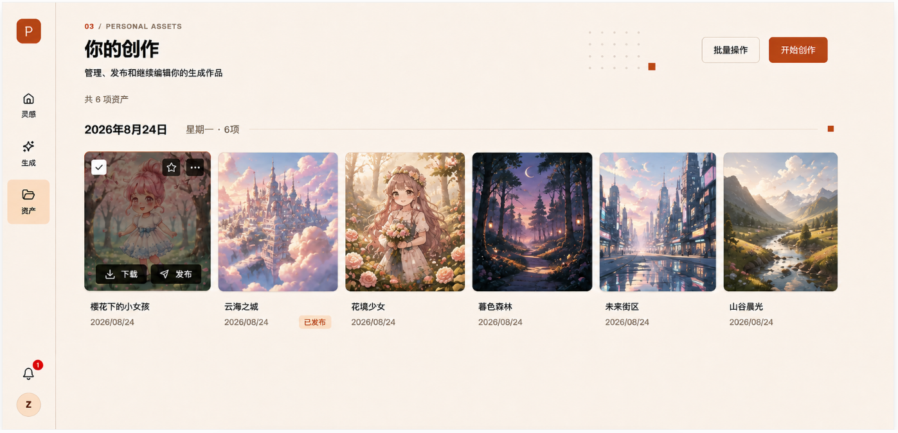

请基于当前已有的个人资产页面，仅改造页面结构、布局和视觉样式。

> 全局主题与色彩令牌以《[全局视觉规范](全局视觉规范.md)》为准：固定暖色浅色主题，不提供暗色模式或页面级主题覆盖。

现有功能、数据、接口、状态、路由和交互逻辑全部保留。本次不重新实现业务功能，只调整DOM结构和CSS。

## 当前未提交实现同步（2026-08-25）

- 已实现暖色页面头部、点阵/强调方块、日期分组和响应式资产网格；点阵与方块使用共享 `editorial-ornaments` 组件，可按页面相对定位和分别调整尺寸。
- 已实现卡片悬浮操作、详情、收藏、发布、删除、下载与底部批量操作栏。未处于批量模式时点击卡片左上角勾选框会进入批量模式并选中该卡片；这是对“勾选资产”的明确交互补充。
- 卡片只使用 `thumbnail`；详情直接复用同一资产的 `display`，下载原图时才申请仅作者可用、有效期 3 分钟的临时 URL。读取失败最多刷新该单图一次。
- 当前状态标签除设计图中的“已发布”外，还会按现有业务数据展示“审核中”和“审核未通过”；不增加虚假的状态筛选或分类控件。

页面最终不包含：

- 分类标签
- 搜索框
- 状态筛选
- 排序控件
- 网格/列表切换
- 右侧悬浮翻译按钮

页面主要由以下结构组成：

```text
个人资产页面
├── 左侧主导航
└── 主内容区
    ├── 页面头部
    │   ├── 页面说明
    │   ├── 资产数量
    │   ├── 批量操作
    │   └── 开始创作
    └── 资产内容区
        ├── 日期分组
        └── 资产网格
            └── 资产卡片
                ├── 图片
                ├── 悬浮操作
                ├── 作品名称
                ├── 发布状态
                └── 创建日期
```

# 一、整体视觉风格

页面延续个人主页和AI创作页的暖色编辑排版风格：

- 暖米白页面背景
- 暖白色功能表面
- 浅杏色选中状态
- 接近黑色的主要文字和按钮
- 少量陶土橙作为强调色
- 使用细线、点阵和小方块建立排版层次
- 圆角保持克制
- 阴影非常轻

统一颜色变量：

```css
:root {
  --page-bg: #f5f0e6;
  --surface-bg: #fffdf7;
  --surface-soft: #faf5eb;

  --peach-light: #f7e3d4;
  --peach: #f1d1bd;

  --terracotta: #c95f3f;
  --terracotta-dark: #ae4d33;

  --ink: #171612;
  --text-primary: #1b1a17;
  --text-secondary: #716b61;
  --text-muted: #9b9387;

  --border: #d9cfbf;
  --border-strong: #bfb3a2;
}
```

禁止使用：

- 蓝色选中状态
- 蓝紫渐变
- 大幅背景图片
- 玻璃拟态
- 霓虹发光
- 超大圆角
- 大量卡片容器
- 虚假资产占位图

------

# 二、页面整体布局

页面采用“固定左侧导航 + 右侧主内容”的结构。

```text
┌────────┬────────────────────────────────────────────┐
│ 88px   │                 主内容区                    │
│ 主导航  │                                            │
└────────┴────────────────────────────────────────────┘
```

页面根节点：

```css
.assets-page {
  display: grid;
  grid-template-columns: 88px minmax(0, 1fr);
  width: 100vw;
  min-height: 100vh;
  background: var(--page-bg);
}
```

左侧导航固定。

主内容区承担页面滚动：

```css
.assets-main {
  min-width: 0;
  min-height: 100vh;
  overflow-y: auto;
  padding: 38px 48px 64px;
}
```

主内容内部增加最大宽度限制：

```css
.assets-container {
  width: 100%;
  max-width: 1640px;
  margin: 0 auto;
}
```

在1920px宽度下：

- 左侧导航：88px
- 主内容左右内边距：48px
- 内容最大宽度：1640px
- 内容水平居中

------

# 三、左侧主导航

左侧导航宽度、结构和其他页面保持一致。

外层：

- 宽度：88px
- 高度：100vh
- `position: fixed`
- 左侧：0
- 顶部：0
- 背景：`#FFFDF7`
- 右侧边框：`1px solid #D9CFBF`
- 使用纵向Flex布局
- `z-index`高于内容区

内部结构：

1. 顶部Logo
2. 中部主要导航
3. 底部通知和用户头像

导航项保留：

```text
灵感
生成
资产
```

导航项：

- 宽度：64px
- 高度：68px
- 图标与文字纵向排列
- 图标尺寸：21px
- 文字字号：13px
- 间距：6px
- 圆角：8px

当前“资产”选中状态：

- 背景：`#F7E3D4`
- 图标颜色：`#171612`
- 文字颜色：`#171612`

不使用蓝色背景和蓝色选中条。

------

# 四、页面头部

页面头部位于主内容区顶部。

整体采用左右两栏布局：

```text
┌─────────────────────────────┬───────────────────────┐
│ 页面标题、描述、资产数量       │ 批量操作、开始创作       │
└─────────────────────────────┴───────────────────────┘
```

头部外层：

```css
.assets-header {
  position: relative;
  display: flex;
  align-items: flex-start;
  justify-content: space-between;
  min-height: 172px;
}
```

头部不要添加完整卡片背景和外边框，直接放在页面背景上。

## 4.1 左侧标题区

左侧从上到下依次为：

1. 微型栏目标题
2. 页面主标题
3. 页面说明
4. 资产总数

微型标题：

```text
03 / PERSONAL ASSETS
```

样式：

- 字号：11px
- 字重：600
- 字母间距：0.16em
- 行高：1
- `03`使用陶土橙
- 其他文字使用灰棕色

主标题：

```text
你的创作
```

样式：

- 距离微型标题：16px
- 字号：36px
- 字重：700
- 行高：1.2
- 颜色：`#171612`

页面说明：

```text
管理、发布和继续编辑你的生成作品
```

样式：

- 距离主标题：14px
- 字号：15px
- 行高：1.6
- 颜色：`#171612`

资产总数：

```text
共6项资产
```

样式：

- 距离页面说明：28px
- 字号：14px
- 颜色：`#716B61`

资产数量不要设计成独立统计卡片。

## 4.2 右侧操作区

右侧操作区放置：

1. 批量操作
2. 开始创作

位置：

- 位于页面头部右上方
- 距离顶部约32px
- 横向排列
- 按钮间距：16px

批量操作按钮：

- 高度：52px
- 水平内边距：24px
- 背景：`#FFFDF7`
- 边框：`1px solid #D9CFBF`
- 文字：`#171612`
- 字号：15px
- 圆角：7px

开始创作按钮：

- 高度：52px
- 水平内边距：26px
- 背景：`#C95F3F`
- 文字：`#FFFDF7`
- 字号：15px
- 圆角：7px

两个按钮不要使用胶囊造型。

## 4.3 头部装饰

在操作按钮左侧附近增加小范围点阵：

- 5列 × 3行
- 点尺寸：3px
- 点间距：10px
- 颜色：`#A99C8D`
- 透明度：40%

点阵右下方增加陶土橙方块：

- 14px × 14px
- 背景：`#C95F3F`

装饰层：

```css
pointer-events: none;
user-select: none;
```

不要增加图片背景或大型装饰色块。

------

# 五、日期分组区域

资产内容直接放在页面头部下方。

不要在页面头部和日期分组之间增加分类、搜索、筛选或排序工具栏。

日期分组距离资产数量：

- 约30px

日期分组头部使用水平布局：

```text
2026年8月24日    星期一 · 6项    ─────────────────── ■
```

外层：

```css
.asset-date-header {
  display: flex;
  align-items: center;
  width: 100%;
  margin-bottom: 18px;
}
```

日期：

```text
2026年8月24日
```

样式：

- 字号：26px
- 字重：700
- 颜色：`#171612`
- 不换行

星期和数量：

```text
星期一 · 6项
```

样式：

- 左侧间距：38px
- 字号：14px
- 颜色：`#716B61`
- 不换行

水平分隔线：

- 左侧间距：22px
- 自动占据剩余空间
- 高度：1px
- 背景：`#D9CFBF`

右侧陶土橙方块：

- 尺寸：10px × 10px
- 背景：`#C95F3F`
- 左侧间距：20px
- 右侧间距：8px

多个日期分组之间间距：

- 48px

------

# 六、资产网格

日期标题下方为资产网格。

桌面端推荐使用CSS Grid：

```css
.assets-grid {
  display: grid;
  grid-template-columns: repeat(6, minmax(0, 1fr));
  gap: 18px;
}
```

在1920px设计稿中显示6列，每列宽度约240～260px。

如果希望卡片略宽，可以使用5列：

```css
grid-template-columns: repeat(5, minmax(0, 1fr));
```

根据现有主内容实际宽度选择5列或6列，但同一断点内列宽必须统一。

单张图片较少时：

- 图片仍然只占一个标准网格单元
- 不要扩大填满整行
- 不要水平居中单张图片
- 保持从网格左侧开始排列
- 不添加虚假占位卡

------

# 七、资产卡片结构

单个资产卡片采用轻量结构：

```text
AssetCard
├── ImageWrapper
│   ├── Image
│   └── HoverOverlay
├── TitleRow
│   ├── Title
│   └── PublishedBadge
└── CreatedDate
```

卡片外层：

- 背景透明
- 不添加完整白色卡片背景
- 不添加外层边框
- 不添加常驻阴影
- `min-width: 0`

图片负责主要视觉，文字直接排列在图片下方。

------

# 八、资产图片

图片容器：

```css
.asset-image-wrapper {
  position: relative;
  width: 100%;
  aspect-ratio: 1 / 1;
  overflow: hidden;
  border: 1px solid var(--border);
  border-radius: 8px;
  background: var(--surface-bg);
}
```

图片：

```css
.asset-image {
  width: 100%;
  height: 100%;
  display: block;
  object-fit: cover;
}
```

图片要求：

- 统一1:1比例
- 不因原图尺寸不同改变卡片高度
- 图片完整覆盖容器
- 不使用额外白色内边距
- 不显示技术参数

------

# 九、资产文字信息

图片与标题之间间距：

- 14px

标题行使用水平Flex布局：

```css
.asset-title-row {
  display: flex;
  align-items: center;
  gap: 8px;
  min-width: 0;
}
```

作品名称：

- 字号：15px
- 字重：600
- 颜色：`#171612`
- 单行显示
- 超出省略
- 占据剩余宽度

示例：

```text
樱花下的小女孩
```

创建日期：

```text
2026/08/24
```

样式：

- 距离标题：8px
- 字号：13px
- 颜色：`#716B61`

## 发布状态

已发布作品在标题行右侧显示：

```text
已发布
```

标签样式：

- 高度：24px
- 水平内边距：8px
- 背景：`#F7E3D4`
- 文字：`#C95F3F`
- 字号：12px
- 圆角：5px
- 不压缩作品标题

未发布作品不显示状态标签。

------

# 十、图片悬浮状态

默认状态下：

- 图片表面不显示按钮
- 不显示永久遮罩
- 不显示永久复选框
- 不显示永久操作栏

鼠标悬浮某张图片时，只作用于当前图片。

## 10.1 遮罩层

```css
.asset-hover-overlay {
  position: absolute;
  inset: 0;
  background: rgba(23, 22, 18, 0.28);
  opacity: 0;
  transition: opacity 160ms ease;
}
```

悬浮时显示：

```css
.asset-image-wrapper:hover .asset-hover-overlay {
  opacity: 1;
}
```

不要让遮罩过深，底层图片仍需清晰可见。

## 10.2 左上角复选框

- 距离顶部：14px
- 距离左侧：14px
- 尺寸：32px × 32px
- 背景：`#FFFDF7`
- 边框：`1px solid #D9CFBF`
- 圆角：6px
- 选中后显示黑色勾选图标

复选框只在悬浮或批量模式下显示。

## 10.3 右上角操作

右上方显示：

1. 收藏
2. 更多

按钮：

- 尺寸：36px × 36px
- 背景：`rgba(23, 22, 18, 0.88)`
- 图标：`#FFFDF7`
- 圆角：6px
- 两个按钮间距：8px
- 距离顶部和右侧：14px

## 10.4 底部操作栏

图片底部中央显示：

1. 下载
2. 发布

操作栏：

- `position: absolute`
- 距离底部：14px
- 水平居中
- 使用Flex布局
- 按钮间距：8px

按钮：

- 高度：38px
- 水平内边距：14px
- 背景：`rgba(23, 22, 18, 0.9)`
- 文字：`#FFFDF7`
- 圆角：6px
- 图标尺寸：16px
- 图标与文字间距：7px

已发布作品可以将“发布”替换为：

```text
查看发布
```

图片悬浮层不要显示生成参数和详情信息。

------

# 十一、批量操作模式

正常状态下只显示页面右上方的“批量操作”按钮。

进入批量模式后：

- 所有资产图片左上角常驻显示复选框
- 已选择图片增加2px陶土橙边框
- 未选择图片保持普通边框
- 图片仍保持原尺寸，不能因边框导致布局抖动

建议使用：

```css
box-shadow: inset 0 0 0 2px var(--terracotta);
```

而不是修改边框宽度。

批量操作模式可以在页面底部显示固定操作栏。

固定操作栏布局：

```text
已选择2项                 取消选择   下载   删除
```

样式：

- 固定在主内容区底部
- 水平居中
- 最大宽度：760px
- 高度：64px
- 背景：`#171612`
- 文字：`#FFFDF7`
- 圆角：10px
- 底部距离：24px
- 轻微阴影
- 不覆盖左侧主导航

如果项目已有批量操作栏，只统一它的尺寸、位置和颜色，不修改功能。

------

# 十二、卡片交互视觉

图片卡片悬浮时：

- 图片整体向上移动2px
- 增加轻微暖色阴影
- 动画时间：160ms

```css
.asset-image-wrapper {
  transition:
    transform 160ms ease,
    box-shadow 160ms ease;
}

.asset-image-wrapper:hover {
  transform: translateY(-2px);
  box-shadow:
    0 2px 4px rgb(43 35 25 / 4%),
    0 12px 26px rgb(43 35 25 / 8%);
}
```

不要添加缩放动画，避免图片网格产生晃动。

------

# 十三、空资产状态

当没有任何资产时，不显示日期分组和空网格。

空状态位于内容区域上方偏中位置：

- 最大宽度：420px
- 水平居中
- 顶部间距：96px
- 纵向排列

空状态使用纯CSS几何图标：

- 两个错位的空心矩形
- 一个陶土橙小方块
- 一个黑色四角星

不使用作品图片或插画。

标题：

```text
还没有创作资产
```

说明：

```text
完成一次图片生成后，作品会保存在这里
```

按钮：

```text
开始创作
```

按钮使用陶土橙背景。

------

# 十四、加载状态

资产加载时，保持真实网格结构。

Skeleton：

- 使用与资产卡片一致的网格
- 图片骨架保持1:1比例
- 标题骨架一行
- 日期骨架一行
- 背景使用暖灰米色
- 不使用高亮蓝色动画

不要使用全屏Loading覆盖页面。

------

# 十五、响应式布局

## 大于1600px

- 主内容左右内边距：48px
- 资产网格：6列
- 网格间距：18px
- 页面标题：36px

## 1280px～1599px

- 主内容左右内边距：40px
- 资产网格：5列
- 网格间距：16px

## 1024px～1279px

- 主内容左右内边距：28px
- 资产网格：4列
- 页面头部操作按钮尺寸保持不变
- 点阵装饰可以缩小

## 768px～1023px

- 主导航按照项目现有方式折叠
- 主内容左右内边距：20px
- 资产网格：3列
- 页面头部允许操作按钮换行
- 日期分隔线长度自适应

## 小于768px

- 使用项目现有移动端导航
- 主内容内边距：16px
- 页面头部改为纵向布局
- 操作按钮移动到标题下方
- 两个操作按钮平分宽度
- 资产网格：2列
- 网格间距：12px
- 日期标题字号降为21px
- 隐藏英文微型装饰或缩小显示
- 批量底部栏左右距离：12px

## 小于480px

- 资产网格仍保持2列
- 卡片标题字号：14px
- 悬浮操作在触摸设备上改为点击图片后出现
- 底部操作按钮只显示图标或使用更紧凑布局

------

# 十六、圆角与阴影规则

圆角：

- 图片：8px
- 普通按钮：7px
- 图标按钮：6px
- 状态标签：5px
- 批量操作栏：10px
- 导航选中项：8px

不要使用超过12px的大圆角。

阴影只用于：

- 图片悬浮
- 批量操作栏
- 必要的浮层

页面头部、日期分组和普通卡片不要添加常驻阴影。

------

# 十七、实现限制

必须遵守：

- 不增加分类工具栏
- 不增加搜索框
- 不增加筛选和排序
- 不增加网格/列表切换
- 不增加右侧翻译按钮
- 不增加背景图片
- 不增加虚假占位卡
- 不展示生成参数
- 不把单张资产放大填满页面
- 不改变现有功能
- 不改变现有数据含义
- 不改变资产详情页跳转逻辑
- 页面主要布局使用Grid和Flex
- 绝对定位只用于装饰元素和图片悬浮层
- 保证长标题不会撑破卡片
- 保证不同图片尺寸不会影响网格对齐

最终页面结构应为：

```text
固定左侧导航
└── 主内容区
    ├── 页面头部
    │   ├── 03 / PERSONAL ASSETS
    │   ├── 你的创作
    │   ├── 页面说明
    │   ├── 资产总数
    │   ├── 批量操作
    │   └── 开始创作
    └── 日期分组
        ├── 日期标题和装饰线
        └── 响应式资产网格
            └── 资产卡片
                ├── 1:1图片
                ├── 悬浮操作
                ├── 作品名称
                ├── 发布状态
                └── 创建日期
```

最终效果应与其他页面保持一致：暖米白底色、黑色标题、浅杏色选中状态、陶土橙强调、轻量图片网格和克制的编辑排版。
